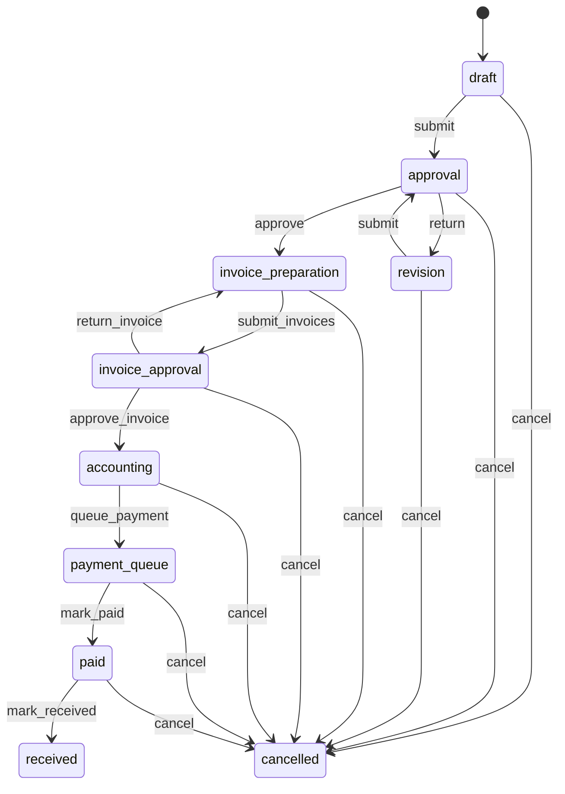

# Модуль Заявки на закупку (Purchase Requests)

**Дата:** 16.08.2026  
**Изменения:** тотальный аудит модуля (presentation / domain / data / docs vs live БД); исправления по итогам: обновление списка после создания, скрытие кнопки «Отправить счета» до UI счетов, `formatPurchaseRequestAmount`, `PurchaseRequestStatusBadge`, `invalidatePurchaseRequestCaches`, проверка `create` в `canEditItems`; актуализация описания workflow, фильтров, прав и статусов.

---

## Важное замечание

- **Owner таблиц:** все таблицы с префиксом `purchase_request_*` — собственность модуля.
- **Смена статуса заявки** возможна **только через RPC** (`SECURITY DEFINER`). Для роли `authenticated` на `purchase_requests` отозваны `INSERT/UPDATE/DELETE`; прямое изменение статуса через PostgREST запрещено.
- **Настройки маршрута** (`purchase_request_settings`) — одна строка на `company_id`. Сохранение — **только владелец компании** (`purchase_request_internal_is_company_owner`). Создание заявки блокируется, пока не заполнены все четыре роли и правило получателя.
- **Пользователи в настройках** — участники `company_members` с активным профилем, **не** сотрудники HR (`employees`). Список для dropdown: RPC `purchase_request_company_users`.
- **Поставщики** — контрагенты из `contractors` с типом supplier (использование, не owner).
- **Нумерация:** `ЗП-YYYY-NNNNN` через `purchase_request_number_seq` + `purchase_request_internal_next_number`.
- **Детали заявки** открываются **в том же экране** (правая панель на desktop, полноэкранная панель на mobile). Отдельный маршрут `/purchase_requests/:id` **удалён**.
- **ФИО в UI:** в списке — через RPC `purchase_request_list` (`created_by_name`); в деталях и истории — отдельный запрос к `profiles` (FK `created_by`/`user_id` → `auth.users`, не `profiles`; PostgREST embed `profiles:created_by` **не работает**).
- **Edge Functions:** для модуля не зарегистрированы (проверка MCP / миграции).

---

## Описание

Модуль управляет жизненным циклом **заявок на закупку** внутри компании: от черновика с позициями до оплаты и подтверждения получения. Каждая заявка имеет **текущего ответственного** (`current_assignee_id`), историю переходов и уведомления.

### Ключевые функции

| Функция | Статус |
|---------|--------|
| Реестр с фильтрами (Мои / На мне / Все / Архив) и поиском | ✅ |
| Дефолтный фильтр «На мне» при открытии модуля | ✅ |
| Двухпанельный desktop-UI (sidebar + таблица / детали) | ✅ |
| Таблица: номер, объект, инициатор, дата, сумма, статус | ✅ |
| Общий бейдж статуса (`PurchaseRequestStatusBadge`) | ✅ |
| Цветные бейджи статусов (светлая / тёмная тема) | ✅ |
| Создание черновика: объект, комментарий, многострочные позиции | ✅ |
| Обновление списка сразу после создания заявки | ✅ |
| Позиции: наименование, ед. изм., количество, артикул | ✅ |
| Панель деталей: KPI-сводка, таблица позиций, таймлайн истории, workflow | ✅ |
| Заголовок деталей: номер крупно + объект · инициатор (подзаголовок) | ✅ |
| Единые design tokens панели деталей (отступы, радиусы, границы) | ✅ |
| История: вертикальный таймлайн (кто → что → когда) | ✅ |
| Добавление / удаление позиций в `draft` / `revision` | ✅ |
| Редактирование существующей позиции (изменение полей) | 🔴 только RPC `updateItem`, UI нет |
| Workflow-кнопки (согласование, оплата, получение, отмена) | ✅ |
| Кнопка «Отправить счета на согласование» | 🔴 скрыта (`_kInvoicesUiEnabled = false`) до UI счетов |
| Настройки маршрута (owner-only), кнопка «Настройки» | ✅ |
| Счета (CRUD + PDF) в UI | 🔴 не реализовано |
| Файлы / документы в UI | 🔴 не реализовано |
| UI уведомлений | 🔴 не реализовано |
| Удаление черновика / правка шапки (объект, комментарий) | 🔴 RPC есть, UI нет |

---

## Зависимости

### Таблицы модуля (owner)

- `purchase_requests`
- `purchase_request_items`
- `purchase_request_invoices`
- `purchase_request_files`
- `purchase_request_history`
- `purchase_request_notifications`
- `purchase_request_settings`
- `purchase_request_number_seq`

### Таблицы других модулей (usage)

| Таблица | Модуль | Использование |
|---------|--------|---------------|
| `objects` | Objects | Объект закупки (`object_id`), join `objects:object_id(name)` в деталях |
| `contractors` | Contractors | Поставщик в счетах (`supplier_id`, type = supplier) |
| `companies` | Company | `company_id`, owner gate для settings |
| `company_members` | Auth | Участники компании для dropdown настроек |
| `profiles` | Profile | ФИО инициатора и участников истории (`short_name` → `full_name` → `email`) |
| `app_modules` | RBAC | Модуль `purchase_requests` в матрице прав |

### Связанные модули

- **Roles** — коды прав: `read`, `create`, `approve`, `prepare_invoice`, `approve_invoice`, `payment`, `receive`, `view_all`
- **Company** — `activeCompanyId`, `activeCompanyProvider`
- **Objects** — выбор объекта при создании
- **Contractors** — поставщики (планируется в UI счетов)

---

## Presentation

### Экраны

| Файл | Назначение |
|------|------------|
| `screens/purchase_requests_list_screen.dart` | Единый экран модуля: placeholder до настройки маршрута; desktop — двухпанельный layout; mobile — список карточек или панель деталей |
| `screens/desktop/purchase_requests_list_desktop_view.dart` | Desktop: левая панель (поиск, фильтры, «Новая заявка», «Настройки») + правая область (таблица или детали) |

### Виджеты

| Файл | Назначение |
|------|------------|
| `widgets/purchase_requests_table.dart` | Таблица реестра (desktop): колонки Номер, Объект, Инициатор, Дата, Сумма, Статус |
| `widgets/purchase_request_details_panel.dart` | Панель деталей: шапка, KPI-сводка, секции позиций/истории, закреплённый подвал действий |
| `widgets/purchase_request_details_summary.dart` | KPI-карточки: статус (акцентная полоса), сумма, кол-во позиций; баннер доработки, комментарий |
| `widgets/purchase_request_details_tokens.dart` | Единые отступы, радиусы, цвета и `BoxDecoration` для панели деталей |
| `widgets/purchase_request_items_table.dart` | Таблица позиций: №, наименование, кол-во, ед., артикул; зебра-строки |
| `widgets/purchase_request_history_timeline.dart` | Вертикальный таймлайн истории (точка + линия, кто → что → когда) |
| `widgets/purchase_request_card.dart` | Карточка в мобильном списке (превью позиций, сумма, бейдж статуса) |
| `widgets/purchase_request_status_badge.dart` | Общий бейдж статуса для списка и таблицы |
| `widgets/purchase_request_create_dialog.dart` | Создание: объект, комментарий; позиции — строки (наименование, ед. изм., кол-во, артикул) |
| `widgets/purchase_request_settings_dialog.dart` | Настройки маршрута (4 роли + режим получателя); пользователи — через `purchaseRequestCompanyUsersProvider` |
| `widgets/purchase_request_actions_bar.dart` | Кнопки workflow; `resolvePurchaseRequestActions` (права + assignee + статус) |
| `utils/purchase_request_ui_labels.dart` | Цвета статусов (`statusColor`), фразы истории (`historyActionPhrase`) |
| `utils/purchase_request_module_utils.dart` | `isPurchaseRequestSettingsConfigured()`, `formatPurchaseRequestAmount()` |

### Провайдеры

| Провайдер | Назначение |
|-----------|------------|
| `purchaseRequestListProvider` | Единый `StateNotifier` списка (без `family`): фильтр, поиск (debounce 300 ms); **дефолтный фильтр** — `onMe` |
| `purchaseRequestDetailsProvider` | Детали заявки (`family` по id) |
| `purchaseRequestItemsProvider` | Позиции |
| `purchaseRequestHistoryProvider` | История |
| `purchaseRequestSettingsProvider` | Настройки компании |
| `purchaseRequestCompanyUsersProvider` | Пользователи для dropdown настроек (используется в `PurchaseRequestSettingsDialog`) |

**Хелпер:** `invalidatePurchaseRequestCaches(ref, requestId)` — сброс кэша деталей, истории, позиций и списка после мутаций.

**DI:** `purchaseRequestRepositoryProvider` → `PurchaseRequestRepositoryImpl(client, activeCompanyId)`; `supabaseClientProvider` из `lib/core/di/providers.dart`. Ошибки списка — `formatSupabaseErrorMessage`; в `FutureProvider` деталей/позиций/истории пока сырой `'$e'` (техдолг).

### Навигация и доступ

- **Маршрут:** `/purchase_requests` (`app_router.dart`, name `purchase_requests`). Вложенный маршрут деталей **отсутствует** — выбор заявки через локальный state `_selectedRequestId`.
- **Drawer:** пункт «Заявки на закупку» (`app_drawer.dart`)
- **Матрица прав:** для `purchase_requests` отключены TMC-специфичные коды (`issue`, `move`, `repair`, …) в `permissions_matrix.dart`

### UX / раскладка

**Desktop (по образцу Cash Flow):**

```
┌─────────────────┬──────────────────────────────────────┐
│ Поиск           │  Таблица заявок  ИЛИ  Детали заявки   │
│ Мои / На мне    │                                      │
│ Все / Архив     │  Колонки: Номер | Объект | Инициатор │
│ Новая заявка    │           Дата | Сумма | Статус      │
│ Настройки       │                                      │
└─────────────────┴──────────────────────────────────────┘
```

- При смене фильтра обновляется только содержимое таблицы, каркас layout сохраняется.
- Клик по строке — детали в правой панели; кнопка «назад» возвращает к таблице.
- После создания заявки список **перезагружается** (`invalidate(purchaseRequestListProvider)`), заявка автоматически открывается в панели деталей.

**Фильтры списка (RPC `purchase_request_list`):**

| Фильтр UI | RPC `p_filter` | Семантика |
|-----------|----------------|-----------|
| Мои | `mine` | Заявки, где `created_by = текущий пользователь` |
| На мне | `on_me` | Заявки, где пользователь `current_assignee`; **черновики исключены** |
| Все | `all` | Свои + где assignee; с `view_all` — все заявки компании |
| Архив | `archive` | Статусы `received`, `cancelled` |

Право `view_all` **не привязано** к вкладкам «Все»/«Архив» — оно расширяет видимость во **всех** фильтрах (в RPC: если нет `view_all`, показываются только свои + где assignee).

**Mobile:**

- Список карточек (`PurchaseRequestCard`) с фильтрами и поиском.
- Тап по карточке — `PurchaseRequestDetailsPanel` на весь экран с кнопкой закрытия; обёртка `MobileAtmosphereMainSurface` с `padding: EdgeInsets.zero` (отступы задаёт сама панель).

**Панель деталей заявки (`PurchaseRequestDetailsPanel`):**

```
┌─────────────────────────────────────────────────────────────┐
│ ←  ЗП-2026-00010                                            │  ← номер крупно
│    ЦОД Дубна ФНС · Тельнов Д.А.                             │  ← объект · инициатор
├─────────────────────────────────────────────────────────────┤
│ ┌──────────┐ ┌─────────┐ ┌─────────┐                        │
│ │ Статус   │ │ Сумма   │ │ Позиций │                        │  ← KPI-карточки
│ │ Черновик │ │    —    │ │    4    │                        │
│ └──────────┘ └─────────┘ └─────────┘                        │
│ [Комментарий инициатора, если есть]                         │
├─────────────────────────────────────────────────────────────┤
│ ПОЗИЦИИ                              [+ Добавить]           │
│ ┌───┬──────────────┬──────┬────┬─────────┐                  │
│ │ № │ Наименование │ Кол-во│ Ед.│ Артикул │                  │
│ └───┴──────────────┴──────┴────┴─────────┘                  │
├─────────────────────────────────────────────────────────────┤
│ ИСТОРИЯ                                                     │
│ ● Тельнов Д.А. создал заявку         16.08.2026 07:46     │  ← таймлайн
├─────────────────────────────────────────────────────────────┤
│                              [Отправить]  [Отменить]        │  ← подвал, справа
└─────────────────────────────────────────────────────────────┘
```

- **Design tokens** (`PurchaseRequestDetailsTokens`): `pagePadding` 20, `sectionGap` 20, `cardRadius` 12, единый `borderColor` (`outline` 10%), фон страницы `#F8FAFC` (light), карточки — белые с лёгкой тенью; шапка/подвал — только линия-разделитель (без дублирования тени).
- **Шапка:** номер заявки (`headlineSmall`, жирный); под ним `{objectName} · {initiatorLabel}`; при переполнении — `ellipsis`.
- **KPI-сводка:** три карточки в ряд (на ширине &lt; 520 px — столбец); статус с цветной полосой слева и точкой; сумма и позиции — с иконками; при `revision` — баннер «Возвращено на доработку»; комментарий — отдельная карточка. Дата создания **не дублируется** — она в истории.
- **Позиции:** bordered-таблица, зебра-строки, заголовок `#F8FAFC`; порядковые номера; удаление — `IconButton` (только `draft`/`revision`); кнопка «Добавить» — `GTTextButton` с иконкой.
- **История:** вертикальный таймлайн (точка + соединительная линия); порядок **кто → что → когда**; комментарий к событию — курсивом под строкой.
- **Подвал:** закреплён внизу (`_ActionsFooter` + `SafeArea`); кнопки workflow выровнены вправо (`Wrap`).

**Диалог создания:**

- Ширина desktop: **980 px**.
- Каждая позиция — одна строка: наименование (flex), ед. изм. (80 px), кол-во (96 px), артикул (128 px).
- Кнопка «+» в заголовке секции позиций; «−» для удаления дополнительных строк.

### Design System

- `GTPrimaryButton`, `GTSecondaryButton`, `GTTextButton`, `GTTextField`, `GTDropdown`
- `DesktopDialogContent`, `MobileBottomSheetContent`
- `AppSnackBar`, `EdgeToEdgeScaffold`
- Панель деталей: собственные токены (`PurchaseRequestDetailsTokens`), без `GTSectionTitle`
- Форматтеры: `formatRuDate`, `formatRuDateTime`, `formatQuantity`, `formatCurrency`, `formatPurchaseRequestAmount` (сумма или «—»)

---

## Domain / Data

### Архитектура слоёв

- **Use Cases:** отсутствуют (`domain/use_cases/` нет). Бизнес-правила кнопок workflow — в `resolvePurchaseRequestActions` (`purchase_request_actions_bar.dart`); gate настроек — `isPurchaseRequestSettingsConfigured()` (дублирует SQL `purchase_request_internal_settings_configured`).
- **Domain entities** с `fromRpcRow` / `fromJson` (`PurchaseRequestListItem`, `PurchaseRequestHistoryEntry`, `PurchaseRequestCompanyUser`) — маппинг в domain (техдолг: перенести в `data/models`).
- **Сущности без Dart-кода:** `purchase_request_invoices`, `purchase_request_files`, `purchase_request_notifications` — только таблицы БД.

### Сущности (domain)

| Сущность | Файл | Описание |
|----------|------|----------|
| `PurchaseRequest` | `purchase_request.dart` | Заявка (Freezed); `createdByName`, геттер `initiatorLabel` |
| `PurchaseRequestItem` | `purchase_request_item.dart` | Позиция (`article` опционально) |
| `PurchaseRequestStatus` | `purchase_request_status.dart` | Enum статусов + `PurchaseRequestListFilter` |
| `PurchaseRequestListItem` | `purchase_request_list_item.dart` | Строка списка (`createdByName`, `initiatorLabel`) |
| `PurchaseRequestSettings` | `purchase_request_settings.dart` | Настройки маршрута |
| `PurchaseRequestHistoryEntry` | `purchase_request_history_entry.dart` | Запись истории; `userName`, геттер `userLabel` |
| `PurchaseRequestCompanyUser` | `purchase_request_company_user.dart` | Пользователь для настроек |

### Репозиторий

- **Интерфейс:** `domain/repositories/purchase_request_repository.dart`
- **Реализация:** `data/repositories/purchase_request_repository_impl.dart`
- **Модели:** `data/models/purchase_request_models.dart` (маппинг JSON ↔ entity)

| Операция | Способ |
|----------|--------|
| `list` | RPC `purchase_request_list` |
| `getRequest` | `SELECT *, objects:object_id(name)` + отдельный запрос `profiles` по `created_by` |
| `getHistory` | `SELECT` из `purchase_request_history` + batch `profiles` по `user_id` |
| `getSettings` | Прямой `SELECT` из `purchase_request_settings` |
| `getItems` | Прямой `SELECT` из `purchase_request_items` |
| `createDraft`, workflow | RPC (см. раздел БД) |
| `updateHeader`, `deleteDraft` | RPC есть, **UI нет** |
| items CRUD | PostgREST insert/delete (RLS); `updateItem` в репозитории — **UI нет** |
| `list` (расширенные параметры) | `objectId`, `status`, `createdBy`, `fromDate`, `toDate`, `limit`, `offset` — в API есть, UI использует только `filter` + `search` |

**Резолвинг ФИО:** `COALESCE(short_name, full_name, email)` — единая логика в `_pickProfileName` / `_fetchUserNames`.

---

## Дерево файлов

```
lib/features/purchase_requests/
├── data/
│   ├── models/
│   │   └── purchase_request_models.dart
│   └── repositories/
│       └── purchase_request_repository_impl.dart
├── domain/
│   ├── entities/
│   │   ├── purchase_request.dart
│   │   ├── purchase_request.freezed.dart
│   │   ├── purchase_request_item.dart
│   │   ├── purchase_request_item.freezed.dart
│   │   ├── purchase_request_list_item.dart
│   │   ├── purchase_request_company_user.dart
│   │   ├── purchase_request_settings.dart
│   │   ├── purchase_request_settings.freezed.dart
│   │   ├── purchase_request_history_entry.dart
│   │   └── purchase_request_status.dart
│   └── repositories/
│       └── purchase_request_repository.dart
└── presentation/
    ├── screens/
    │   ├── purchase_requests_list_screen.dart
    │   └── desktop/
    │       └── purchase_requests_list_desktop_view.dart
    ├── state/
    │   └── purchase_request_providers.dart
    ├── utils/
    │   ├── purchase_request_ui_labels.dart
    │   └── purchase_request_module_utils.dart
    └── widgets/
        ├── purchase_request_actions_bar.dart
        ├── purchase_request_card.dart
        ├── purchase_request_create_dialog.dart
        ├── purchase_request_details_panel.dart
        ├── purchase_request_details_summary.dart
        ├── purchase_request_details_tokens.dart
        ├── purchase_request_history_timeline.dart
        ├── purchase_request_items_table.dart
        ├── purchase_request_settings_dialog.dart
        ├── purchase_request_status_badge.dart
        └── purchase_requests_table.dart

supabase/migrations/
├── 20260815160000_create_purchase_requests_module.sql
├── 20260815161000_purchase_requests_rpc.sql
├── 20260815170000_remove_purchase_request_required_date.sql
├── 20260815170500_purchase_request_settings_owner_gate.sql
├── 20260815172000_purchase_request_company_users_rpc.sql
├── 20260815172500_fix_purchase_request_list_created_at.sql
├── 20260815173000_purchase_request_list_created_by_name.sql
└── 20260815173500_purchase_request_item_article.sql
```

---

## База данных (Audit)

**Аудит live БД:** 16.08.2026 через MCP `project-0-projectgt-supabase` (`api.progt.ru`).

### Таблица `purchase_requests`

| Колонка | Тип | NULL | Описание |
|---------|-----|------|----------|
| `id` | uuid | NO | PK |
| `company_id` | uuid | NO | FK → companies |
| `number` | text | NO | Уникальный номер `ЗП-YYYY-NNNNN` |
| `object_id` | uuid | NO | FK → objects |
| `created_by` | uuid | NO | FK → auth.users |
| `current_assignee_id` | uuid | YES | Текущий ответственный |
| `status` | text | NO | Статус workflow |
| `comment` | text | YES | Комментарий инициатора |
| `total_amount` | numeric | NO | Сумма счетов (default 0) |
| `created_at` | timestamptz | NO | |
| `updated_at` | timestamptz | NO | |
| `submitted_at` | timestamptz | YES | |
| `completed_at` | timestamptz | YES | Финальный статус |

**Индексы:** `purchase_requests_pkey`, `purchase_requests_number_company_uq`, `idx_purchase_requests_company_status`, `idx_purchase_requests_assignee`, `idx_purchase_requests_created_by`, `idx_purchase_requests_object`, `idx_purchase_requests_number_trgm` (GIN).

### Таблица `purchase_request_items`

| Колонка | Тип | NULL | Описание |
|---------|-----|------|----------|
| `id` | uuid | NO | PK |
| `company_id` | uuid | NO | FK → companies |
| `request_id` | uuid | NO | FK → purchase_requests |
| `name` | text | NO | Наименование |
| `quantity` | numeric | NO | > 0 |
| `unit` | text | NO | Единица (default `шт`) |
| `article` | text | YES | Артикул |
| `comment` | text | YES | |
| `sort_order` | int | NO | Порядок |
| `created_at` | timestamptz | NO | |

**Индексы:** `idx_purchase_request_items_request`, `idx_purchase_request_items_name_trgm` (GIN).

### Таблица `purchase_request_invoices`

| Колонка | Тип | Описание |
|---------|-----|----------|
| `id`, `company_id`, `request_id`, `supplier_id` | | Счета поставщиков |
| `invoice_number`, `invoice_date`, `amount`, `comment` | | Реквизиты счёта |
| `created_by`, `created_at`, `updated_at` | | Аудит (UI 🔴) |

**Индексы:** `idx_purchase_request_invoices_request`, `idx_purchase_request_invoices_supplier`.

### Таблица `purchase_request_files`

| Колонка | Тип | Описание |
|---------|-----|----------|
| `id`, `company_id`, `request_id` | | Файлы заявки |
| `invoice_id` | uuid | Связь со счётом (nullable) |
| `type`, `storage_path`, `file_name`, `mime_type`, `size` | | Метаданные Storage |
| `uploaded_by`, `created_at` | | (UI 🔴) |

**Индексы:** `idx_purchase_request_files_request`, `idx_purchase_request_files_invoice`.

### Таблица `purchase_request_history`

| Колонка | Тип | Описание |
|---------|-----|----------|
| `id` | uuid | PK |
| `company_id` | uuid | FK → companies |
| `request_id` | uuid | FK → purchase_requests |
| `user_id` | uuid | FK → auth.users (автор действия) |
| `action` | text | Код действия (`created`, `submitted`, …) |
| `from_status`, `to_status` | text | Статусы до/после |
| `comment` | text | Комментарий к переходу |
| `metadata` | jsonb | Доп. данные (напр. `received_date`) |
| `created_at` | timestamptz | Время события |

**Индексы:** `idx_purchase_request_history_request (request_id, created_at DESC)`.

Записи **неизменяемы** для `authenticated` (только `SELECT`; insert — через internal RPC).

### Таблица `purchase_request_notifications`

| Колонка | Тип | Описание |
|---------|-----|----------|
| `id`, `company_id`, `request_id`, `user_id` | | Получатель |
| `title` | text | Заголовок |
| `body` | text | Текст (nullable) |
| `is_read` | boolean | Прочитано |
| `created_at` | timestamptz | |

**Индексы:** `idx_purchase_request_notifications_user (user_id, is_read, created_at DESC)`.

### Таблица `purchase_request_settings`

| Колонка | Тип | Описание |
|---------|-----|----------|
| `company_id` | uuid PK | |
| `first_approver_id` | uuid | Первый согласующий |
| `invoice_preparer_id` | uuid | Подготовка счетов |
| `invoice_approver_id` | uuid | Согласование счетов |
| `accountant_id` | uuid | Бухгалтер |
| `receiver_mode` | text | `fixed_user` \| `initiator` |
| `fixed_receiver_id` | uuid | При `receiver_mode = fixed_user` |
| `created_at`, `updated_at`, `updated_by` | | |

### Таблица `purchase_request_number_seq`

| Колонка | Тип | Описание |
|---------|-----|----------|
| `company_id`, `year` | | PK (составной) |
| `last_value` | int | Счётчик номеров по году |

### RLS

| Таблица | RLS |
|---------|-----|
| `purchase_requests` | ✅ Включён |
| `purchase_request_items` | ✅ |
| `purchase_request_invoices` | ✅ |
| `purchase_request_files` | ✅ |
| `purchase_request_history` | ✅ |
| `purchase_request_notifications` | ✅ |
| `purchase_request_settings` | ✅ |
| `purchase_request_number_seq` | ❌ Отключён (internal) |

**Ключевые политики:**

- `purchase_requests`: `pr_requests_select` — `purchase_request_can_read(company_id, created_by, current_assignee_id)`
- `purchase_request_items`: insert/update/delete — только автор в `draft`/`revision`
- `purchase_request_history`: только `SELECT` для authenticated
- `purchase_request_settings`: update — `purchase_request_internal_is_company_owner`
- `purchase_request_notifications`: select/update — только `user_id = uid()`

### Storage

- Bucket: `purchase-requests` (политики на upload/read по `company_id` в путях файлов)

### RPC (публичные, `authenticated`)

| Функция | Назначение |
|---------|------------|
| `purchase_request_list` | Список: `mine` / `on_me` / `all` / `archive`; `created_by_name` из `profiles` |
| `purchase_request_create_draft` | Черновик (+ gate: settings configured) |
| `purchase_request_update_header` | Обновление объекта/комментария в `draft`/`revision` |
| `purchase_request_delete_draft` | Удаление черновика |
| `purchase_request_submit` | `draft`/`revision` → `approval` |
| `purchase_request_approve` | Согласование → `invoice_preparation` |
| `purchase_request_return` | Возврат на доработку → `revision` |
| `purchase_request_submit_invoices` | Отправка счетов на согласование |
| `purchase_request_approve_invoice` | Согласование счетов → `accounting` |
| `purchase_request_return_invoice` | Возврат счетов → `invoice_preparation` |
| `purchase_request_queue_payment` | Очередь оплаты |
| `purchase_request_mark_paid` | Оплачено → получатель |
| `purchase_request_mark_received` | Получено (финал) |
| `purchase_request_cancel` | Отмена |
| `purchase_request_upsert_settings` | Сохранение настроек (owner only) |
| `purchase_request_company_users` | Список пользователей для dropdown |

**Возврат `purchase_request_list`:** `id`, `number`, `object_id`, `object_name`, `status`, `created_by`, `created_by_name`, `current_assignee_id`, `total_amount`, `created_at`, `items_preview`, `items_count`.

### Внутренние функции

| Функция | Назначение |
|---------|------------|
| `purchase_request_internal_transition` | Единая точка смены статуса |
| `purchase_request_internal_write_history` | Запись в history |
| `purchase_request_internal_notify` | Записи в notifications |
| `purchase_request_internal_resolve_receiver` | Получатель по settings |
| `purchase_request_internal_settings_configured` | Проверка полноты настроек |
| `purchase_request_internal_is_company_owner` | Gate для settings |
| `purchase_request_internal_next_number` | Нумерация |
| `purchase_request_internal_assert_company` | Проверка company_id |
| `purchase_request_can_read` | RLS helper |
| `purchase_request_recalc_total_amount` | Пересчёт `total_amount` по счетам |

### Статистика live (16.08.2026)

| Таблица | Строк (оценка) |
|---------|----------------|
| `purchase_requests` | 10 |
| `purchase_request_items` | 14 |
| `purchase_request_history` | 13 |
| `purchase_request_settings` | 1 |
| `purchase_request_notifications` | 2 |
| `purchase_request_invoices` | 0 |
| `purchase_request_files` | 0 |

---

## Бизнес-логика

### Статусы

Подписи в UI — `PurchaseRequestStatus.displayName` (extension `PurchaseRequestStatusX`).

| Код | UI (рус.) | Цвет бейджа |
|-----|-----------|-------------|
| `draft` | Черновик | Серый |
| `approval` | На согласовании | Синий |
| `revision` | На доработке | Оранжевый |
| `invoice_preparation` | Формирование счета | Фиолетовый |
| `invoice_approval` | Согласование счета | Голубой |
| `accounting` | Передано бухгалтеру | Бирюзовый |
| `payment_queue` | Заведено на оплату | Янтарный |
| `paid` | Оплачено | Зелёный |
| `received` | Получено | Тёмно-зелёный |
| `cancelled` | Отменено | Красный |

Цвета — `PurchaseRequestUiLabels.statusColor`; отображение — `PurchaseRequestStatusBadge` (список/таблица) или KPI-карточка (детали).

### Workflow (основной путь)



> **Этап счетов:** переход `invoice_preparation → invoice_approval` требует ≥1 счёта с PDF в БД. Кнопка в UI **скрыта** (`_kInvoicesUiEnabled = false`) до реализации экрана счетов.

### Ответственные (`current_assignee_id`)

| Этап | Assignee |
|------|----------|
| `draft`, `revision` | `created_by` |
| `approval` | `settings.first_approver_id` |
| `invoice_preparation` | `settings.invoice_preparer_id` |
| `invoice_approval` | `settings.invoice_approver_id` |
| `accounting`, `payment_queue` | `settings.accountant_id` |
| `paid` | Получатель: `fixed_receiver_id` или `created_by` (`receiver_mode`) |
| `received`, `cancelled` | `NULL` |

### Права на действия (RPC + UI)

| Действие | Permission | Assignee / автор | Доп. условия |
|----------|------------|------------------|--------------|
| Создание / submit | `create` | автор | ≥1 позиция; settings configured |
| Добавление / удаление позиций | `create` (RLS) | автор | `draft` / `revision`; `canEditItems` в UI |
| approve / return | `approve` | current | return: обязателен comment |
| submit invoices | `prepare_invoice` | current | счета + PDF в БД; **кнопка скрыта** в UI |
| approve / return invoice | `approve_invoice` | current | |
| queue payment / mark paid | `payment` | current | |
| mark received | `receive` | current (receiver) | |
| cancel | **нет** | автор **или** `view_all` | любой статус кроме `received` / `cancelled` |
| Чтение списка | `read` | — | + правило видимости |
| Все заявки компании | `view_all` | — | расширяет видимость во всех фильтрах |

Логика кнопок на клиенте — `resolvePurchaseRequestActions` (`purchase_request_actions_bar.dart`). После мутаций — `invalidatePurchaseRequestCaches`.

### Gate: настройки перед созданием

`purchase_request_create_draft` → `purchase_request_internal_settings_configured`:

- `first_approver_id`, `invoice_preparer_id`, `invoice_approver_id`, `accountant_id` — NOT NULL
- `receiver_mode = fixed_user` → `fixed_receiver_id` NOT NULL
- `receiver_mode = initiator` → fixed не требуется

### Позиции

- **Добавление / удаление** — только в `draft` и `revision` (RLS + `canEditItems`; требуется permission `create`)
- **Изменение полей** существующей позиции — RPC/репозиторий `updateItem` есть, **UI нет**
- Submit без позиций — предупреждение на клиенте + ошибка на сервере
- `unit` — свободный текст; `article` — опциональный
- В диалоге добавления позиции **из деталей** артикул пока **не запрашивается** (техдолг)
- `sort_order` при insert не задаётся клиентом (default 0; порядок по `created_at`)

### История (отображение)

| Элемент | Источник | Формат в UI |
|---------|----------|-------------|
| Кто | `profiles` по `user_id` | `userLabel` (жирный, слева) |
| Что | `action` → `historyActionPhrase` | строчная фраза после ФИО |
| Когда | `created_at` | `formatRuDateTime`, справа, muted |
| Комментарий | `comment` | **отдельная строка** курсивом под действием |

Пример:

```
Тельнов Д.А. создал заявку          16.08.2026 07:46
Причина возврата (курсив, если есть)
```

Коды действий → фразы: `PurchaseRequestUiLabels.historyActionPhrase`. Поля `from_status` / `to_status` и `metadata` (даты оплаты/получения) в entity есть, в UI **не отображаются** (техдолг).

### Получение после оплаты

`purchase_request_mark_paid` назначает `current_assignee_id` = resolved receiver и создаёт уведомление. `mark_received` записывает `received_date` в `metadata` истории и завершает заявку (`completed_at`).

### Нумерация

Формат: `ЗП-{год}-{5 цифр}`. Счётчик в `purchase_request_number_seq` по `(company_id, year)`, поле `last_value`.

---

## Интеграции

| Компонент | Связь |
|-----------|-------|
| **RBAC** | `app_modules` code `purchase_requests`; `check_permission` в RPC |
| **Objects** | `object_id` при создании; join имени в деталях |
| **Contractors** | `purchase_request_invoices.supplier_id` (планируется UI) |
| **Profiles** | ФИО в списке (RPC), деталях и истории (batch SELECT) |
| **Supabase Storage** | bucket `purchase-requests` для файлов счетов |
| **Notifications** | Таблица + RPC notify; in-app UI отсутствует |
| **Edge Functions** | Не используются |

---

## Roadmap

### Реализовано 🟢

- Схема БД, RLS, Storage bucket
- Полный набор workflow RPC
- Двухпанельный desktop-UI (sidebar + таблица / детали)
- Master-detail в одном экране (без отдельного route)
- Таблица реестра с инициатором и цветными статусами
- Общий бейдж статуса и формат суммы (`formatPurchaseRequestAmount`)
- Многострочное создание заявки с артикулом
- Обновление списка после создания заявки
- Панель деталей: KPI-сводка, таблица позиций, таймлайн истории, workflow actions
- Единые design tokens панели деталей (отступы, радиусы, границы)
- Двухуровневая шапка (номер + объект · инициатор)
- Вертикальный таймлайн истории (кто → что → когда)
- Закреплённый подвал действий (кнопки справа)
- `invalidatePurchaseRequestCaches` после мутаций
- Настройки маршрута (owner), кнопка «Настройки»
- Матрица прав, drawer, router
- Human-readable ошибки Supabase в списке и диалогах

### Баги / техдолг 🟡

- UI счетов не связан с `purchase_request_invoices`; кнопка submit invoices **скрыта** до реализации
- Блок «Документы» / `purchase_request_files` не в UI
- Уведомления пишутся в БД, но не отображаются
- Добавление позиции из деталей — без поля артикула
- Нет UI для `updateItem`, `updateHeader`, `deleteDraft`
- Бизнес-логика workflow в presentation, не в domain use cases
- `PurchaseRequestHistoryEntry.metadata` не показывается в таймлайне
- ФИО в деталях/истории — дополнительный round-trip к `profiles` (нет FK embed)
- Ошибки в `FutureProvider` деталей — сырой текст исключения
- Пагинация списка (`limit=50`) не используется в UI
- E2E сценарий по ТЗ (20 шагов) не автоматизирован

### Планы 🔴

1. Экран/секция «Счета»: CRUD, выбор поставщика, upload PDF; включить `_kInvoicesUiEnabled`
2. Секция «Документы» с Storage
3. Badge / список уведомлений в модуле
4. Артикул в диалоге добавления позиции из деталей
5. UI редактирования позиций (`updateItem`) и шапки черновика (`updateHeader`)
6. UI удаления черновика (`deleteDraft`)
7. Domain use cases / перенос `resolvePurchaseRequestActions` из виджета
8. RPC или view для истории с `user_name` (убрать N+1 batch на клиенте)
9. Экспорт списка заявок (если потребуется `export` permission)
10. Cross-link в `docs/database_structure.md`

---

## Права модуля (RBAC)

Коды в `permissionsList` + использование в RPC:

| Code | Название в UI |
|------|---------------|
| `read` | Просмотр |
| `create` | Создание |
| `approve` | Согласование |
| `prepare_invoice` | Счета |
| `approve_invoice` | Согласование счетов |
| `payment` | Оплата |
| `receive` | Получение |
| `view_all` | Все заявки |

Для модуля **отключены** в матрице: `update`, `delete`, `export`, `import`, `issue`, `move`, `repair`, `write_off`, `inventory`, `view_cost`, `manage_catalogs`.

---

*Документ подготовлен по аудиту кода (`lib/features/purchase_requests/`), миграций `supabase/migrations/` и live PostgreSQL (`api.progt.ru`, 16.08.2026). При изменении миграций, RPC или UI — обновить этот файл.*
