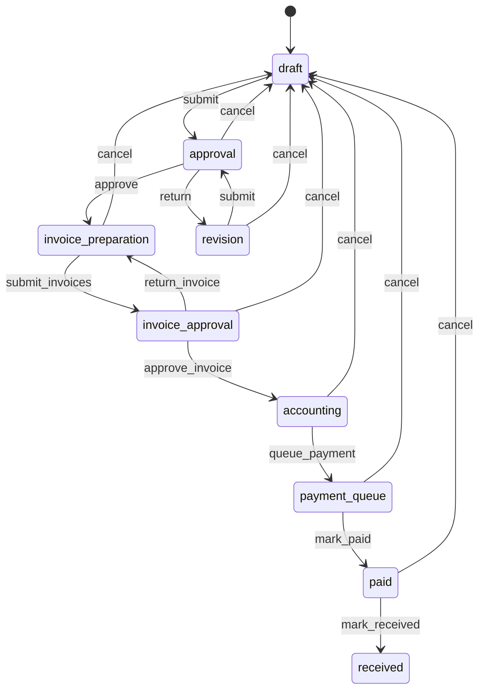

# Модуль Заявки на закупку (Purchase Requests)

**Дата:** 16.08.2026  
**Изменения:** фильтры реестра по **статусу** (На согласовании / Согласованы / Все / Архив); вкладки «Мои» и «На мне» удалены. Ранее: отмена = возврат в черновик; правка и удаление своего черновика; просмотр файлов счетов.

---

## Важное замечание

- **Owner таблиц:** все таблицы с префиксом `purchase_request_*` — собственность модуля.
- **Смена статуса заявки** возможна **только через RPC** (`SECURITY DEFINER`). Для роли `authenticated` на `purchase_requests` отозваны `INSERT/UPDATE/DELETE`; прямое изменение статуса через PostgREST запрещено.
- **Настройки маршрута** (`purchase_request_settings`) — одна строка на `company_id`. Сохранение — **только владелец компании** (`purchase_request_internal_is_company_owner`). Создание заявки блокируется, пока не заполнены все четыре роли и правило получателя.
- **Пользователи в настройках** — участники `company_members` с активным профилем, **не** сотрудники HR (`employees`). Список для dropdown: RPC `purchase_request_company_users`.
- **Поставщики** — контрагенты из `contractors` с типом `supplier`; выбор в диалоге счёта (`GTDropdown`, `contractorNotifierProvider`).
- **Счета и файлы:** создание счёта — PostgREST INSERT + upload в Storage + INSERT в `purchase_request_files` (type = `invoice`). Если upload прошёл, а INSERT метаданных упал — объект в Storage удаляется, затем DELETE счёта. Отправка на согласование — только RPC `purchase_request_submit_invoices` (≥1 счёт, у каждого — файл). Update счёта в UI **нет** (только удаление + повторное добавление). **Просмотр и скачивание** — `storage.download` по `storage_path` (путь обязан начинаться с `activeCompanyId/`); UI-кнопки у всех, кто видит заявку (`purchase_request_can_read`); Storage SELECT — permission `read`.
- **Нумерация:** `ЗП-YYYY-NNNNN` через `purchase_request_number_seq` + `purchase_request_internal_next_number`.
- **Детали заявки** открываются **в том же экране** (правая панель на desktop, полноэкранная панель на mobile). Отдельный маршрут `/purchase_requests/:id` **удалён**.
- **ФИО в UI:** единая логика `pickProfileDisplayName` / `formatUserDisplayLabel` (`lib/core/utils/user_display_utils.dart`); в списке — RPC `purchase_request_list` (`created_by_name`); в деталях и истории — batch-запрос к `profiles`.
- **Gate «Настройки» в UI:** `isCompanyOwnerProvider` → `Profile.isOwner` из `company_members.is_owner` (не `systemRole`).
- **Write без компании:** все мутации репозитория вызывают `_requireCompany()` → `PurchaseRequestCompanyRequiredException`.
- **Свой черновик:** правка шапки/позиций и удаление заявки — только автор, только статус `draft` (RPC + UI). Право `view_all` чужой черновик удалить не может. На этапе `revision` можно менять позиции, но не шапку и не удалять заявку.
- **Отмена:** не финальный статус. RPC `purchase_request_cancel` переводит заявку в `draft`, assignee = автор, причина пишется в историю (`action = cancelled`). Кнопка «Вернуть в черновик» скрыта у черновика и у «Получено». Статус `cancelled` в CHECK остаётся для старых данных; живые строки с ним переведены в `draft` миграцией `20260816194000`.
- **Список после действий:** `invalidatePurchaseRequestCaches` **не** делает `invalidate` notifier списка (это сбрасывало бы фильтр на дефолт «Все»). Вызывается `refreshPurchaseRequestList` → `PurchaseRequestListNotifier.load(quiet: true)` с текущими `filter`/`search`.
- **Edge Functions:** в `supabase/functions/` нет функций модуля; инструмент MCP `list_edge_functions` в текущем сервере отсутствует.

---

## Описание

Модуль управляет жизненным циклом **заявок на закупку** внутри компании: от черновика с позициями до оплаты и подтверждения получения. Каждая заявка имеет **текущего ответственного** (`current_assignee_id`), историю переходов и уведомления.

### Ключевые функции

| Функция | Статус |
|---------|--------|
| Реестр с фильтрами (На согласовании / Согласованы / Все / Архив) и поиском | ✅ |
| Дефолтный фильтр «Все» при открытии модуля | ✅ |
| Двухпанельный desktop-UI (sidebar + таблица / детали) | ✅ |
| Таблица: номер, объект, инициатор, дата, сумма, статус | ✅ |
| Общий бейдж статуса (`PurchaseRequestStatusBadge`) | ✅ |
| Цветные бейджи статусов (светлая / тёмная тема) | ✅ |
| Создание черновика: объект, комментарий, многострочные позиции | ✅ |
| Редактирование своего черновика (объект, комментарий, позиции) | ✅ |
| Удаление своего черновика | ✅ |
| Обновление списка сразу после создания заявки | ✅ |
| Фильтр и поиск сохраняются после действий по заявке | ✅ |
| Открытая заявка не закрывается, если её нет в текущем фильтре (напр. черновик при «На согласовании») | ✅ |
| Позиции: наименование, ед. изм., количество, артикул | ✅ |
| Панель деталей: KPI-сводка, таблица позиций, таймлайн истории, workflow | ✅ |
| Заголовок деталей: номер крупно + объект · инициатор (подзаголовок) | ✅ |
| Единые design tokens панели деталей (отступы, радиусы, границы) | ✅ |
| История: вертикальный таймлайн (кто → что → когда) | ✅ |
| Добавление / удаление позиций в `draft` / `revision` (в т.ч. артикул из деталей) | ✅ |
| Редактирование позиции (`updateItem`) | ✅ в диалоге правки черновика |
| Workflow-кнопки (согласование, оплата, получение, возврат в черновик) | ✅ |
| Кнопка «Отправить на согласование» (этап `invoice_preparation`) | ✅ |
| Секция «Счета» в панели деталей (добавление / удаление / файл) | ✅ |
| Просмотр файла счёта в приложении (PDF / JPG / PNG) | ✅ |
| Скачивание файла счёта на устройство | ✅ |
| Диалог добавления счёта (поставщик, сумма, номер, дата, PDF/изображение) | ✅ |
| Валидация счетов перед submit (кнопка неактивна без файлов) | ✅ |
| Настройки маршрута (owner-only), кнопка «Настройки» | ✅ (`isCompanyOwnerProvider`) |
| Баннер «Показаны первые 50 заявок» при лимите списка | ✅ |
| Единый виджет фильтров mobile/desktop | ✅ `PurchaseRequestFilterBar` |
| Редактирование счёта после создания | 🔴 только удаление + повторное добавление |
| Отдельный блок «Документы» (не invoice) | 🔴 не реализовано |
| UI уведомлений | 🔴 не реализовано |
| Удаление черновика / правка шапки (объект, комментарий) | ✅ только своя заявка в `draft` |

---

## Зависимости

### Таблицы модуля (owner)

- `purchase_requests`
- `purchase_request_items`
- `purchase_request_invoices`
- `purchase_request_files`
- `purchase_request_history`
- `purchase_request_notifications`
- `purchase_request_settings`
- `purchase_request_number_seq`

### Таблицы других модулей (usage)

| Таблица | Модуль | Использование |
|---------|--------|---------------|
| `objects` | Objects | Объект закупки (`object_id`), join `objects:object_id(name)` в деталях |
| `contractors` | Contractors | Поставщик в счетах (`supplier_id`, type = supplier) |
| `companies` | Company | `company_id`, owner gate для settings |
| `company_members` | Auth | Участники компании для dropdown настроек |
| `profiles` | Profile | ФИО инициатора и участников истории (`short_name` → `full_name` → `email`) |
| `app_modules` | RBAC | Модуль `purchase_requests` в матрице прав |

### Связанные модули

- **Roles** — коды прав: `read`, `create`, `approve`, `prepare_invoice`, `approve_invoice`, `payment`, `receive`, `view_all`
- **Company** — `activeCompanyIdProvider`, `isCompanyOwnerProvider` (gate кнопки «Настройки»)
- **Profile** — `Profile.isOwner` (из `company_members.is_owner` при загрузке профиля)
- **Core** — `user_display_utils.dart` (ФИО), `formatSupabaseErrorMessage`, `saveFileBytesToUserDevice`, `openAttachmentFilePreview`
- **Objects** — выбор объекта при создании
- **Contractors** — поставщики в диалоге счёта (`ContractorType.supplier`)

---

## Presentation

### Экраны

| Файл | Назначение |
|------|------------|
| `screens/purchase_requests_list_screen.dart` | Единый экран модуля: placeholder до настройки маршрута; desktop — двухпанельный layout; mobile — список карточек или панель деталей; state: `_selectedRequestId` |
| `screens/desktop/purchase_requests_list_desktop_view.dart` | Desktop: левая панель (поиск, фильтры, «Новая заявка», «Настройки») + правая область (таблица или детали) |

### Виджеты

| Файл | Назначение |
|------|------------|
| `widgets/purchase_requests_table.dart` | Таблица реестра (desktop): `GTSectionTitle`, колонки Номер, Объект, Инициатор, Дата, Сумма, Статус |
| `widgets/purchase_request_filter_bar.dart` | Единые фильтры: mobile — chip-сегменты (`PayrollToolbarSegmentChip`); desktop sidebar — плитки |
| `widgets/purchase_request_list_limit_banner.dart` | Баннер при `isTruncatedByLimit` (лимит 50) |
| `widgets/purchase_request_details_panel.dart` | Панель деталей: шапка, KPI-сводка, секции позиций/**счетов**/истории, закреплённый подвал действий |
| `widgets/purchase_request_invoices_section.dart` | Секция «Счета»: список карточек, просмотр/скачивание файла, «Добавить» / удаление; `shouldShow(status)` |
| `widgets/purchase_request_invoice_dialog.dart` | Диалог добавления счёта: поставщик (`GTDropdown`), сумма, номер, дата, файл (`file_selector`) |
| `widgets/purchase_request_details_summary.dart` | KPI-карточки: статус (акцентная полоса), сумма, кол-во позиций; баннер доработки, комментарий |
| `widgets/purchase_request_details_tokens.dart` | Единые отступы, радиусы, цвета и `BoxDecoration` для панели деталей |
| `widgets/purchase_request_items_table.dart` | Таблица позиций: №, наименование, кол-во, ед., артикул; зебра-строки |
| `widgets/purchase_request_history_timeline.dart` | Вертикальный таймлайн истории (точка + линия, кто → что → когда) |
| `widgets/purchase_request_card.dart` | Карточка в мобильном списке (превью позиций, сумма, бейдж статуса) |
| `widgets/purchase_request_status_badge.dart` | Общий бейдж статуса для списка и таблицы (единый стиль, `maxLines: 1`) |
| `widgets/purchase_request_create_dialog.dart` | Создание и редактирование черновика: объект, комментарий, позиции |
| `widgets/purchase_request_settings_dialog.dart` | Настройки маршрута (4 роли + режим получателя); пользователи — через `purchaseRequestCompanyUsersProvider` |
| `widgets/purchase_request_actions_bar.dart` | Кнопки workflow; `resolvePurchaseRequestActions` (права + assignee + статус); `hasAny`; предупреждения submit только после `AsyncValue.hasValue` |
| `utils/purchase_request_invoice_utils.dart` | `purchaseRequestInvoicesReadyForSubmit()`, `isPurchaseRequestInvoiceFilePreviewable()` |
| `utils/purchase_request_invoice_file_flow.dart` | Скачивание и просмотр файла счёта (`downloadInvoiceFile` + `openAttachmentFilePreview`) |
| `utils/purchase_request_ui_labels.dart` | Цвета статусов (`statusColor`), фразы истории (`historyActionPhrase`), `idleActionsMessage` |
| `utils/purchase_request_module_utils.dart` | `isPurchaseRequestSettingsConfigured()`, `formatPurchaseRequestAmount()` |
| `utils/purchase_request_form_dialog.dart` | `showPurchaseRequestFormDialog` — desktop `DesktopDialogContent`, mobile `MobileBottomSheetContent` (`useSafeArea: true`) |

### Провайдеры

| Провайдер | Назначение |
|-----------|------------|
| `purchaseRequestListProvider` | Единый `StateNotifier` списка: фильтр (дефолт **`all`**), поиск (debounce 300 ms), **`kPurchaseRequestListLimit = 50`**, флаг **`isTruncatedByLimit`** |
| `purchaseRequestDetailsProvider` | Детали заявки (`family` по id) |
| `purchaseRequestItemsProvider` | Позиции |
| `purchaseRequestHistoryProvider` | История |
| `purchaseRequestInvoicesProvider` | Счета с прикреплёнными файлами (`family` по id) |
| `purchaseRequestInvoiceFileBusyIdsProvider` | Id файлов счетов, которые сейчас скачиваются или открываются (`family` по `requestId`) |
| `purchaseRequestSettingsProvider` | Настройки компании |
| `purchaseRequestCompanyUsersProvider` | Пользователи для dropdown настроек (используется в `PurchaseRequestSettingsDialog`) |

**Хелперы:**
- `refreshPurchaseRequestList(ref)` — `load(quiet: true)` без пересоздания notifier (фильтр и поиск сохраняются).
- `invalidatePurchaseRequestCaches(ref, requestId)` — сброс кэша деталей, истории, позиций, **счетов** + `refreshPurchaseRequestList`.

**Company:** `isCompanyOwnerProvider` (`company_providers.dart`) — `profile.isOwner == true` для кнопки «Настройки».

**DI:** `purchaseRequestRepositoryProvider` → `PurchaseRequestRepositoryImpl(client, activeCompanyId)`; write-методы проверяют `_hasCompany`. Ошибки списка — `formatSupabaseErrorMessage`; в `FutureProvider` деталей/позиций/истории пока сырой `'$e'` (техдолг).

### Навигация и доступ

- **Маршрут:** `/purchase_requests` (`app_router.dart`, name `purchase_requests`). Вложенный маршрут деталей **отсутствует** — выбор заявки через локальный state `_selectedRequestId`. Открытая панель не закрывается автоматически, если заявки нет в текущем фильтре списка (например черновик при «На согласовании»).
- **Drawer:** пункт «Заявки на закупку» (`app_drawer.dart`)
- **Матрица прав:** для `purchase_requests` отключены TMC-специфичные коды (`issue`, `move`, `repair`, …) в `permissions_matrix.dart`

### UX / раскладка

**Desktop (по образцу Cash Flow):**

```
┌───────────────────────┬──────────────────────────────────────┐
│ Поиск                 │  Таблица заявок  ИЛИ  Детали заявки   │
│ На согласовании       │                                      │
│ Согласованы / Все     │  Колонки: Номер | Объект | Инициатор │
│ Архив                 │           Дата | Сумма | Статус      │
│ Новая заявка          │                                      │
│ Настройки             │                                      │
└───────────────────────┴──────────────────────────────────────┘
```

- При смене фильтра обновляется только содержимое таблицы, каркас layout сохраняется.
- Desktop: фильтры — `PurchaseRequestFilterBar.desktopSidebar` в sidebar; при лимите — баннер над таблицей.
- Клик по строке — детали в правой панели; кнопка «назад» в шапке панели деталей (`showCloseButton`).
- После создания заявки список **перезагружается** (`refreshPurchaseRequestList`), заявка открывается в панели деталей (`_selectedRequestId`). Черновик может отсутствовать во вкладке «На согласовании» / «Согласованы» — панель деталей всё равно остаётся открытой, пока пользователь не закроет её.
- `ref.listen` на исчезновение заявки из списка **удалён** (мёртвая ветка: выбор всегда совпадал с «закреплением»).

**Фильтры списка (RPC `purchase_request_list`, миграция `20260816203000` / live `purchase_request_list_status_filters`):**

Вкладки **не** делят заявки на «мои / не мои». Значения `mine` / `on_me` **удалены**. Неизвестный `p_filter` **не** показывает все строки (нет fallback).

| Фильтр UI | Enum | RPC `p_filter` | Семантика |
|-----------|------|----------------|-----------|
| На согласовании | `pendingApproval` | `pending_approval` | Статус **`approval`** |
| Согласованы | `approved` | `approved` | Статусы `invoice_preparation`, `invoice_approval`, `accounting`, `payment_queue`, `paid` |
| Все | `all` | `all` | Все видимые заявки, включая черновики, доработку и архив |
| Архив | `archive` | `archive` | Статус `received` (и устаревший `cancelled`, если останется) |

Черновик (`draft`) и доработка (`revision`) видны **только** во «Все».

Право `view_all` **не привязано** к вкладке «Все» — оно расширяет видимость во **всех** фильтрах (в RPC: если нет `view_all`, показываются только свои + где `current_assignee_id`).

Дефолт UI: `PurchaseRequestListFilter.all`. Параметр `p_status` в RPC есть, в UI не используется.

**Mobile:**

- Список карточек (`PurchaseRequestCard`): номер, объект, превью позиций, сумма, статус — **без колонки инициатора** (в desktop-таблице инициатор есть).
- Фильтры — `PurchaseRequestFilterBar.mobile` (chip-сегменты, не Material `ChoiceChip`).
- При `isTruncatedByLimit` — `PurchaseRequestListLimitBanner`.
- Breakpoint — `EmployeesLayoutUtils.useEmployeesMobileList` (`shortestSide < 600`).
- Тап по карточке — `PurchaseRequestDetailsPanel` на весь экран; **кнопка «Назад»** — в шапке `PurchaseRequestsListScreen` (не внутри панели); обёртка `MobileAtmosphereMainSurface` с `padding: EdgeInsets.zero` (отступы задаёт сама панель).
- Фон экрана: `MobileAtmosphereBackdrop` + `Scaffold` (не `EdgeToEdgeScaffold`).

**Панель деталей заявки (`PurchaseRequestDetailsPanel`):**

```
┌─────────────────────────────────────────────────────────────┐
│ ←  ЗП-2026-00010                                            │  ← номер крупно
│    ЦОД Дубна ФНС · Тельнов Д.А.                             │  ← объект · инициатор
├─────────────────────────────────────────────────────────────┤
│ ┌──────────┐ ┌─────────┐ ┌─────────┐                        │
│ │ Статус   │ │ Сумма   │ │ Позиций │                        │  ← KPI-карточки
│ │ Черновик │ │    —    │ │    4    │                        │
│ └──────────┘ └─────────┘ └─────────┘                        │
│ [Комментарий инициатора, если есть]                         │
├─────────────────────────────────────────────────────────────┤
│ ПОЗИЦИИ                              [+ Добавить]           │
│ ┌───┬──────────────┬──────┬────┬─────────┐                  │
│ │ № │ Наименование │ Кол-во│ Ед.│ Артикул │                  │
│ └───┴──────────────┴──────┴────┴─────────┘                  │
├─────────────────────────────────────────────────────────────┤
│ СЧЕТА                                [+ Добавить]           │  ← invoice_preparation+
│ ┌ Поставщик · сумма · № · дата · файл ✓/✗ ──────────────┐  │
│ └────────────────────────────────────────────────────────┘  │
├─────────────────────────────────────────────────────────────┤
│ ИСТОРИЯ                                                     │
│ ● Тельнов Д.А. создал заявку         16.08.2026 07:46     │  ← таймлайн
├─────────────────────────────────────────────────────────────┤
│                              [Отправить]  [Отменить]        │  ← подвал, справа
└─────────────────────────────────────────────────────────────┘
```

- **Design tokens** (`PurchaseRequestDetailsTokens`): `pagePadding` 20, `sectionGap` 20, `cardRadius` 12, единый `borderColor` (`outline` 10%), фон страницы `#F8FAFC` (light), карточки — белые с лёгкой тенью; шапка/подвал — только линия-разделитель (без дублирования тени).
- **Шапка:** номер заявки (`headlineSmall`, жирный); под ним `{objectName} · {initiatorLabel}`; при переполнении — `ellipsis`.
- **KPI-сводка:** три карточки в ряд (на ширине &lt; 520 px — столбец); статус с цветной полосой слева и точкой; сумма и позиции — с иконками; при `revision` — баннер «Возвращено на доработку»; комментарий — отдельная карточка. Дата создания **не дублируется** — она в истории.
- **Позиции:** bordered-таблица, зебра-строки, заголовок `#F8FAFC`; порядковые номера; удаление — `IconButton` (только `draft`/`revision`); кнопка «Добавить» — `GTTextButton` с иконкой; диалог добавления — `showPurchaseRequestFormDialog` (наименование, количество, ед. изм., **артикул**).
- **Счета:** секция `PurchaseRequestInvoicesSection` — видна при статусах `invoice_preparation` … `received`; управление (добавить/удалить) — только при `canSubmitInvoices` (assignee + `prepare_invoice` + `invoice_preparation`); карточка показывает поставщика, сумму (`formatCurrency`), номер, дату, имя файла; иконка ✓/✗ по `hasInvoiceFile`. При наличии файла — кнопки **Просмотреть** (`Icons.visibility_outlined`) и **Скачать** (`Icons.download_outlined`) для любого, кто видит заявку; спиннер — `purchaseRequestInvoiceFileBusyIdsProvider`. Просмотр: PDF — `printing.PdfPreview`, JPG/PNG — диалог с `InteractiveViewer`; прочие форматы — snackbar «скачайте файл». Скачивание: `saveFileBytesToUserDevice`. Диалог добавления — `PurchaseRequestInvoiceDialog` (desktop `DesktopDialogContent`, mobile `MobileBottomSheetContent` + `useSafeArea: true`).
- **Подвал действий:** предупреждения «Добавьте позицию» / «Добавьте счёт» и блокировка submit **только если** соответствующий `AsyncValue.hasValue` (во время загрузки кнопки неактивны, ложного текста нет). При `canSubmitInvoices` кнопка «Отправить на согласование» неактивна, пока `purchaseRequestInvoicesReadyForSubmit(invoices) == false`. Если действий нет: `idleActionsMessage` — «Заявка получена» / «Заявка отменена» / «Ожидает действия ответственного».
- **История:** вертикальный таймлайн (точка + соединительная линия); порядок **кто → что → когда**; на клиенте загрузка `ORDER BY created_at ASC` (старые события сверху); комментарий к событию — курсивом под строкой.
- **Подвал:** закреплён внизу (`_ActionsFooter` + `SafeArea`); кнопки workflow выровнены вправо (`Wrap`).

**Диалог создания:**

- Ширина desktop: **980 px**.
- Каждая позиция — одна строка: наименование (flex), ед. изм. (80 px), кол-во (96 px), артикул (128 px).
- Кнопка «+» в заголовке секции позиций; «−» для удаления дополнительных строк.

### Design System

- `GTPrimaryButton`, `GTSecondaryButton`, `GTTextButton`, `GTTextField`, `GTDropdown`
- `DesktopDialogContent`, `MobileBottomSheetContent` — создание заявки, настройки, **диалог счёта**, комментарий workflow, добавление позиции (`showPurchaseRequestFormDialog`)
- `file_selector` (`openFile`) — выбор файла счёта (PDF / изображение)
- `openAttachmentFilePreview` (`lib/core/widgets/attachment_file_preview.dart`) — просмотр PDF (`printing.PdfPreview`) и изображений
- `saveFileBytesToUserDevice` (`lib/core/utils/attachment_file_save.dart`) — сохранение файла счёта на устройство
- `GTSectionTitle` — заголовок desktop-таблицы реестра
- `AppSnackBar`, `MobileAtmosphereBackdrop`, `MobileAtmosphereMainSurface`, `MobileAtmosphereChromeCircleButton`
- Фильтры: `PurchaseRequestFilterBar` + `PayrollToolbarSegmentChip` (mobile)
- Панель деталей: собственные токены (`PurchaseRequestDetailsTokens`)
- Форматтеры: `formatRuDate`, `formatRuDateTime`, `formatQuantity`, `formatCurrency`, `formatPurchaseRequestAmount`
- ФИО: `pickProfileDisplayName`, `formatUserDisplayLabel` (`lib/core/utils/user_display_utils.dart`)

---

## Domain / Data

### Архитектура слоёв

- **Use Cases:** отсутствуют (`domain/use_cases/` нет). Бизнес-правила кнопок workflow — в `resolvePurchaseRequestActions` (`purchase_request_actions_bar.dart`); gate настроек — `isPurchaseRequestSettingsConfigured()` (дублирует SQL `purchase_request_internal_settings_configured`).
- **Domain entities** с `fromRpcRow` / `fromJson`: `PurchaseRequestListItem`, `PurchaseRequestCompanyUser` — `fromRpcRow`; `PurchaseRequestHistoryEntry` — только `fromJson`; `PurchaseRequestInvoice` / `PurchaseRequestFile` — маппинг в `PurchaseRequestInvoiceModel` / `PurchaseRequestFileModel`. Маппинг в domain (техдолг: перенести остальное в `data/models`).
- **Сущности без Dart-кода:** `purchase_request_notifications` — только таблица БД.

### Сущности (domain)

| Сущность | Файл | Описание |
|----------|------|----------|
| `PurchaseRequest` | `purchase_request.dart` | Заявка (Freezed); `initiatorLabel` → `formatUserDisplayLabel(createdByName)` |
| `PurchaseRequestItem` | `purchase_request_item.dart` | Позиция (`article` опционально) |
| `PurchaseRequestStatus` | `purchase_request_status.dart` | Enum статусов (+ `unknown` для ошибок данных), `parseFromDb`, `PurchaseRequestListFilter` (`pendingApproval` / `approved` / `all` / `archive`) |
| `PurchaseRequestListItem` | `purchase_request_list_item.dart` | Строка списка; `initiatorLabel` через `formatUserDisplayLabel` |
| `PurchaseRequestSettings` | `purchase_request_settings.dart` | Настройки маршрута (в entity: без `created_at`/`updated_at`/`updated_by`) |
| `PurchaseRequestHistoryEntry` | `purchase_request_history_entry.dart` | Запись истории; `userName`, `userLabel` → `formatUserDisplayLabel`; `fromJson`: `from_status`/`to_status` — `null` → `null`, иначе `parseFromDb`; без `company_id`, `metadata` |
| `PurchaseRequestCompanyUser` | `purchase_request_company_user.dart` | Пользователь для настроек; `displayName` через `pickUserDisplayName` |
| `PurchaseRequestInvoice` | `purchase_request_invoice.dart` | Счёт поставщика; `hasInvoiceFile`, `invoiceFile` |
| `PurchaseRequestFile` | `purchase_request_file.dart` | Метаданные файла (`type`, `storagePath`, `fileName`, `mimeType`, `size`) |
| `PurchaseRequestCompanyRequiredException` | `purchase_request_repository_exception.dart` | Нет активной компании при write |

### Репозиторий

- **Интерфейс:** `domain/repositories/purchase_request_repository.dart`
- **Реализация:** `data/repositories/purchase_request_repository_impl.dart`
- **Модели:** `data/models/purchase_request_models.dart` (маппинг JSON ↔ entity)

| Операция | Способ |
|----------|--------|
| `list` | RPC `purchase_request_list` |
| `getRequest` | `SELECT *, objects:object_id(name)` + отдельный запрос `profiles` по `created_by` |
| `getHistory` | `SELECT` из `purchase_request_history` + batch `profiles` по `user_id` |
| `getInvoices` | `SELECT` из `purchase_request_invoices` + join `contractors`; batch `purchase_request_files` (type = `invoice`) |
| `createInvoiceWithFile` | INSERT счёта → upload Storage → INSERT файла; при ошибке после upload — `storage.remove`, затем DELETE счёта |
| `deleteInvoice` | DELETE счёта (CASCADE файлов) + best-effort `storage.remove` (`_removeStoragePaths`) |
| `downloadInvoiceFile` | `storage.download` из bucket `purchase_requests`; путь должен начинаться с `activeCompanyId/` |
| `getSettings` | Прямой `SELECT` из `purchase_request_settings` |
| `getItems` | Прямой `SELECT` из `purchase_request_items` |
| `createDraft`, workflow | RPC (см. раздел БД) |
| `updateHeader` | RPC `purchase_request_update_header` |
| `deleteDraft` | RPC `purchase_request_delete_draft` |
| items add/delete/update | PostgREST insert/delete/update (RLS); `addItem`, `deleteItem`, **`updateItem`** |
| `upsertSettings` | RPC + проверка `settings.companyId == activeCompanyId` |
| `list` (расширенные параметры) | `objectId`, `status`, `createdBy`, `fromDate`, `toDate`, `limit`, `offset` — UI использует `filter` + `search` + **`limit=50`** |

**Guard:** все write-методы → `_requireCompany()` → `PurchaseRequestCompanyRequiredException`.

**Парсинг статуса:** `PurchaseRequestStatusX.parseFromDb` — при неизвестном значении лог + `PurchaseRequestStatus.unknown` (не fallback в `draft`).

**Резолвинг ФИО:** `pickProfileDisplayName` / `_fetchUserNames` в репозитории; `user_display_utils.dart` в models/entities.

---

## Дерево файлов

```
lib/features/purchase_requests/
├── data/
│   ├── models/
│   │   └── purchase_request_models.dart
│   └── repositories/
│       └── purchase_request_repository_impl.dart
├── domain/
│   ├── entities/
│   │   ├── purchase_request.dart
│   │   ├── purchase_request.freezed.dart
│   │   ├── purchase_request_item.dart
│   │   ├── purchase_request_item.freezed.dart
│   │   ├── purchase_request_list_item.dart
│   │   ├── purchase_request_company_user.dart
│   │   ├── purchase_request_settings.dart
│   │   ├── purchase_request_settings.freezed.dart
│   │   ├── purchase_request_history_entry.dart
│   │   ├── purchase_request_invoice.dart
│   │   ├── purchase_request_file.dart
│   │   ├── purchase_request_repository_exception.dart
│   │   └── purchase_request_status.dart
│   └── repositories/
│       └── purchase_request_repository.dart
└── presentation/
    ├── screens/
    │   ├── purchase_requests_list_screen.dart
    │   └── desktop/
    │       └── purchase_requests_list_desktop_view.dart
    ├── state/
    │   └── purchase_request_providers.dart
    ├── utils/
    │   ├── purchase_request_invoice_utils.dart
    │   ├── purchase_request_invoice_file_flow.dart
    │   ├── purchase_request_form_dialog.dart
    │   ├── purchase_request_ui_labels.dart
    │   └── purchase_request_module_utils.dart
    └── widgets/
        ├── purchase_request_actions_bar.dart
        ├── purchase_request_card.dart
        ├── purchase_request_create_dialog.dart
        ├── purchase_request_details_panel.dart
        ├── purchase_request_details_summary.dart
        ├── purchase_request_details_tokens.dart
        ├── purchase_request_filter_bar.dart
        ├── purchase_request_history_timeline.dart
        ├── purchase_request_invoice_dialog.dart
        ├── purchase_request_invoices_section.dart
        ├── purchase_request_items_table.dart
        ├── purchase_request_list_limit_banner.dart
        ├── purchase_request_settings_dialog.dart
        ├── purchase_request_status_badge.dart
        └── purchase_requests_table.dart

test/features/purchase_requests/
└── purchase_request_logic_test.dart   # статусы, user_display_utils, resolvePurchaseRequestActions, invoices ready, previewable, idleActionsMessage, history fromJson (21 тест)

lib/core/utils/
├── user_display_utils.dart            # pickProfileDisplayName, formatUserDisplayLabel
└── attachment_file_save.dart          # saveFileBytesToUserDevice

lib/core/widgets/
└── attachment_file_preview.dart       # openAttachmentFilePreview (PDF / изображение)

lib/features/company/presentation/providers/
└── company_providers.dart             # isCompanyOwnerProvider

supabase/migrations/
├── 20260815160000_create_purchase_requests_module.sql
├── 20260815161000_purchase_requests_rpc.sql
├── 20260815170000_remove_purchase_request_required_date.sql
├── 20260815170500_purchase_request_settings_owner_gate.sql
├── 20260815172000_purchase_request_company_users_rpc.sql
├── 20260815172500_fix_purchase_request_list_created_at.sql
├── 20260815173000_purchase_request_list_created_by_name.sql
├── 20260815173500_purchase_request_item_article.sql
├── 20260815174000_purchase_request_storage_prepare_invoice_upload.sql
├── 20260816191000_purchase_request_own_draft_edit_delete.sql
├── 20260816194000_purchase_request_cancel_to_draft.sql
└── 20260816203000_purchase_request_list_status_filters.sql
```

---

## База данных (Audit)

**Аудит live БД:** 16.08.2026 через MCP `project-0-projectgt-supabase` (`api.progt.ru`).

### Таблица `purchase_requests`

| Колонка | Тип | NULL | Описание |
|---------|-----|------|----------|
| `id` | uuid | NO | PK |
| `company_id` | uuid | NO | FK → companies |
| `number` | text | NO | Уникальный номер `ЗП-YYYY-NNNNN` |
| `object_id` | uuid | NO | FK → objects |
| `created_by` | uuid | NO | FK → auth.users |
| `current_assignee_id` | uuid | YES | Текущий ответственный |
| `status` | text | NO | Статус workflow |
| `comment` | text | YES | Комментарий инициатора |
| `total_amount` | numeric | NO | Сумма счетов (default 0) |
| `created_at` | timestamptz | NO | |
| `updated_at` | timestamptz | NO | |
| `submitted_at` | timestamptz | YES | |
| `completed_at` | timestamptz | YES | Финальный статус |

**Индексы:** `purchase_requests_pkey`, `purchase_requests_number_company_uq`, `idx_purchase_requests_company_status`, `idx_purchase_requests_assignee`, `idx_purchase_requests_created_by`, `idx_purchase_requests_object`, `idx_purchase_requests_number_trgm` (GIN).

### Таблица `purchase_request_items`

| Колонка | Тип | NULL | Описание |
|---------|-----|------|----------|
| `id` | uuid | NO | PK |
| `company_id` | uuid | NO | FK → companies |
| `request_id` | uuid | NO | FK → purchase_requests |
| `name` | text | NO | Наименование |
| `quantity` | numeric | NO | > 0 |
| `unit` | text | NO | Единица (default `шт`) |
| `article` | text | YES | Артикул |
| `comment` | text | YES | |
| `sort_order` | int | NO | Порядок |
| `created_at` | timestamptz | NO | |

**Индексы:** `idx_purchase_request_items_request`, `idx_purchase_request_items_name_trgm` (GIN).

### Таблица `purchase_request_invoices`

| Колонка | Тип | Описание |
|---------|-----|----------|
| `id`, `company_id`, `request_id`, `supplier_id` | | Счета поставщиков |
| `invoice_number`, `invoice_date`, `amount`, `comment` | | Реквизиты счёта |
| `created_by`, `created_at`, `updated_at` | | Аудит |

**RLS insert/update/delete:** assignee + `prepare_invoice` + статус заявки `invoice_preparation` (delete также в `invoice_approval`).

**Индексы:** `idx_purchase_request_invoices_request`, `idx_purchase_request_invoices_supplier`.

### Таблица `purchase_request_files`

| Колонка | Тип | Описание |
|---------|-----|----------|
| `id`, `company_id`, `request_id` | | Файлы заявки |
| `invoice_id` | uuid | Связь со счётом (nullable) |
| `type`, `storage_path`, `file_name`, `mime_type`, `size` | | Метаданные Storage |
| `uploaded_by`, `created_at` | | |

**Типы `type`:** `invoice` (к счёту), прочие — для будущего блока «Документы».

**Индексы:** `idx_purchase_request_files_request`, `idx_purchase_request_files_invoice`.

### Таблица `purchase_request_history`

| Колонка | Тип | Описание |
|---------|-----|----------|
| `id` | uuid | PK |
| `company_id` | uuid | FK → companies |
| `request_id` | uuid | FK → purchase_requests |
| `user_id` | uuid | FK → auth.users (автор действия) |
| `action` | text | Код действия (`created`, `submitted`, …) |
| `from_status`, `to_status` | text | Статусы до/после |
| `comment` | text | Комментарий к переходу |
| `metadata` | jsonb | Доп. данные (напр. `received_date`) |
| `created_at` | timestamptz | Время события |

**Индексы:** `idx_purchase_request_history_request (request_id, created_at DESC)`.

Записи **неизменяемы** для `authenticated` (только `SELECT`; insert — через internal RPC).

### Таблица `purchase_request_notifications`

| Колонка | Тип | Описание |
|---------|-----|----------|
| `id`, `company_id`, `request_id`, `user_id` | | Получатель |
| `title` | text | Заголовок |
| `body` | text | Текст (nullable) |
| `is_read` | boolean | Прочитано |
| `created_at` | timestamptz | |

**Индексы:** `idx_purchase_request_notifications_user (user_id, is_read, created_at DESC)`.

### Таблица `purchase_request_settings`

| Колонка | Тип | Описание |
|---------|-----|----------|
| `company_id` | uuid PK | |
| `first_approver_id` | uuid | Первый согласующий |
| `invoice_preparer_id` | uuid | Подготовка счетов |
| `invoice_approver_id` | uuid | Согласование счетов |
| `accountant_id` | uuid | Бухгалтер |
| `receiver_mode` | text | `fixed_user` \| `initiator` |
| `fixed_receiver_id` | uuid | При `receiver_mode = fixed_user` |
| `created_at`, `updated_at`, `updated_by` | | |

### Таблица `purchase_request_number_seq`

| Колонка | Тип | Описание |
|---------|-----|----------|
| `company_id`, `year` | | PK (составной) |
| `last_value` | int | Счётчик номеров по году |

### RLS

| Таблица | RLS |
|---------|-----|
| `purchase_requests` | ✅ Включён |
| `purchase_request_items` | ✅ |
| `purchase_request_invoices` | ✅ |
| `purchase_request_files` | ✅ |
| `purchase_request_history` | ✅ |
| `purchase_request_notifications` | ✅ |
| `purchase_request_settings` | ✅ |
| `purchase_request_number_seq` | ❌ Отключён (internal) |

**Ключевые политики:**

- `purchase_requests`: `pr_requests_select` — `purchase_request_can_read(company_id, created_by, current_assignee_id)`
- `purchase_request_items`: insert/update/delete — только автор в `draft`/`revision`
- `purchase_request_invoices`: insert/update/delete — assignee в `invoice_preparation` (+ delete в `invoice_approval`) с `prepare_invoice`
- `purchase_request_files`: insert — по этапу (draft/revision, invoice_preparation, payment и др.)
- `purchase_request_history`: только `SELECT` для authenticated
- `purchase_request_settings`: update — `purchase_request_internal_is_company_owner`
- `purchase_request_notifications`: select/update — только `user_id = uid()`

### Storage

- Bucket: **`purchase_requests`** (id и name совпадают), **private** (`public = false`, live 16.08.2026)
- **Путь файла счёта:** `{company_id}/{request_id}/invoices/{invoice_id}/{timestamp}_{safeFileName}`
- **Допустимые расширения в UI:** `pdf`, `jpg`, `jpeg`, `png` (`purchaseRequestInvoiceAcceptedExtensions`)
- **Политики `storage.objects` (live, 16.08.2026):**
  - `purchase_requests_bucket_select` — `bucket_id = purchase_requests`, первый сегмент пути ∈ `get_my_company_ids()`, permission **`read`** (нужно для просмотра и скачивания)
  - `purchase_requests_bucket_insert` — тот же company_id + (`create` **или** `prepare_invoice` **или** `payment` **или** `receive`); миграция `20260815174000` расширила INSERT для `prepare_invoice` (ранее только `create`)
  - `purchase_requests_bucket_delete` — те же права, что INSERT

### RPC (публичные, `authenticated`)

| Функция | Назначение |
|---------|------------|
| `purchase_request_list` | Список: `pending_approval` / `approved` / `all` / `archive`; `created_by_name` из `profiles` |
| `purchase_request_create_draft` | Черновик (+ gate: settings configured) |
| `purchase_request_update_header` | Объект/комментарий: только автор, только `draft`, право `create` |
| `purchase_request_delete_draft` | Удаление: только автор, только `draft`, право `create` |
| `purchase_request_submit` | `draft`/`revision` → `approval` |
| `purchase_request_approve` | Согласование → `invoice_preparation` |
| `purchase_request_return` | Возврат на доработку → `revision` |
| `purchase_request_submit_invoices` | Отправка счетов на согласование |
| `purchase_request_approve_invoice` | Согласование счетов → `accounting` |
| `purchase_request_return_invoice` | Возврат счетов → `invoice_preparation` |
| `purchase_request_queue_payment` | Очередь оплаты |
| `purchase_request_mark_paid` | Оплачено → получатель |
| `purchase_request_mark_received` | Получено (финал) |
| `purchase_request_cancel` | Возврат в `draft` с обязательной причиной |
| `purchase_request_upsert_settings` | Сохранение настроек (owner only) |
| `purchase_request_company_users` | Список пользователей для dropdown |

**Возврат `purchase_request_list`:** `id`, `number`, `object_id`, `object_name`, `status`, `created_by`, `created_by_name`, `current_assignee_id`, `total_amount`, `created_at`, `items_preview`, `items_count`.

### Внутренние функции

| Функция | Назначение |
|---------|------------|
| `purchase_request_internal_transition` | Единая точка смены статуса |
| `purchase_request_internal_write_history` | Запись в history |
| `purchase_request_internal_notify` | Записи в notifications |
| `purchase_request_internal_resolve_receiver` | Получатель по settings |
| `purchase_request_internal_settings_configured` | Проверка полноты настроек |
| `purchase_request_internal_is_company_owner` | Gate для settings |
| `purchase_request_internal_next_number` | Нумерация |
| `purchase_request_internal_assert_company` | Проверка company_id |
| `purchase_request_can_read` | RLS helper |
| `purchase_request_recalc_total_amount` | Пересчёт `total_amount` по счетам |

### Статистика live (16.08.2026, MCP `pg_stat_user_tables.n_live_tup`)

| Таблица | Строк (оценка) |
|---------|----------------|
| `purchase_requests` | 14 |
| `purchase_request_items` | 19 |
| `purchase_request_history` | 33 |
| `purchase_request_settings` | 1 |
| `purchase_request_notifications` | 13 |
| `purchase_request_invoices` | 1 |
| `purchase_request_files` | 1 |
| `purchase_request_number_seq` | 1 |

---

## Бизнес-логика

### Статусы

Подписи в UI — `PurchaseRequestStatus.displayName` (extension `PurchaseRequestStatusX`).

| Код | UI (рус.) | Цвет бейджа |
|-----|-----------|-------------|
| `draft` | Черновик | Серый |
| `approval` | На согласовании | Синий |
| `revision` | На доработке | Оранжевый |
| `invoice_preparation` | Формирование счета | Фиолетовый |
| `invoice_approval` | Согласование счета | Голубой |
| `accounting` | Передано бухгалтеру | Бирюзовый |
| `payment_queue` | Заведено на оплату | Янтарный |
| `paid` | Оплачено | Зелёный |
| `received` | Получено | Тёмно-зелёный |
| `cancelled` | Отменено | Красный |
| *(ошибка данных)* | `unknown` → «Неизвестный статус» | Коричневый |

Цвета — `PurchaseRequestUiLabels.statusColor`; отображение — `PurchaseRequestStatusBadge` (список/таблица) или KPI-карточка (детали).

### Workflow (основной путь)



> **Этап счетов:** переход `invoice_preparation → invoice_approval` требует ≥1 счёта и файла `type = invoice` у **каждого** счёта (валидация RPC + клиент `purchaseRequestInvoicesReadyForSubmit`). UI: секция «Счета», диалог добавления, кнопка «Отправить на согласование» с блокировкой до готовности.

### Счета (формирование и отправка)

**Кто может:** `current_assignee_id` + permission `prepare_invoice` + статус `invoice_preparation`.

**Добавление счёта (клиент, `createInvoiceWithFile`):**

1. INSERT в `purchase_request_invoices` (`supplier_id`, `amount`, опционально `invoice_number`, `invoice_date`, `comment`).
2. Upload файла в Storage bucket `purchase_requests`.
3. INSERT в `purchase_request_files` (`invoice_id`, `type = 'invoice'`, `storage_path`, `file_name`, `mime_type`, `size`).
4. Если шаг 2 успешен, а шаг 3 падает — `storage.remove` загруженного пути, затем DELETE счёта.
5. Если шаг 2 падает — DELETE счёта (объекта в Storage нет).

**Удаление счёта (`deleteInvoice`):** DELETE строки счёта (CASCADE файлов в БД), затем best-effort `storage.remove`. Если Storage не ответил — запись в БД уже удалена, объект может остаться orphan (логируется).

**Просмотр и скачивание файла (`downloadInvoiceFile`):**

1. Клиент берёт `invoiceFile.storagePath` из `getInvoices`.
2. Репозиторий проверяет `storagePath.startsWith('$activeCompanyId/')`, иначе `ArgumentError`.
3. `client.storage.from('purchase_requests').download(storagePath)` — RLS Storage: `read` + company в пути.
4. **Скачать** (`downloadPurchaseRequestInvoiceFile`) → `saveFileBytesToUserDevice`.
5. **Просмотреть** (`previewPurchaseRequestInvoiceFile`) → если `isPurchaseRequestInvoiceFilePreviewable` (pdf / jpg / jpeg / png или MIME `application/pdf` / `image/*`) → `openAttachmentFilePreview`; иначе snackbar.
6. Пока идёт download — id файла в `purchaseRequestInvoiceFileBusyIdsProvider`; индикатор снимается до открытия окна просмотра.

**Отправка на согласование (`submitInvoices` → RPC `purchase_request_submit_invoices`):**

| Проверка | Ошибка RPC |
|----------|------------|
| Статус `invoice_preparation` | «Недопустимый статус» |
| `current_assignee_id = auth.uid()` | «Access denied» |
| Permission `prepare_invoice` | «Access denied» |
| ≥1 счёт | «Добавьте хотя бы один счёт» |
| Файл у каждого счёта | «Для каждого счёта нужен файл» |
| `invoice_approver_id` в settings | «Не настроен финальный согласующий» |

После успеха: статус → `invoice_approval`, assignee → `invoice_approver_id`, history `invoices_submitted`, уведомление согласующему.

**Клиентская валидация (до RPC):** `purchaseRequestInvoicesReadyForSubmit` — непустой список и `invoices.every((i) => i.hasInvoiceFile)`. Кнопка и предупреждение в `PurchaseRequestActionsBar` только после загрузки списка счетов (`hasValue`).

### Ответственные (`current_assignee_id`)

| Этап | Assignee |
|------|----------|
| `draft`, `revision` | `created_by` |
| `approval` | `settings.first_approver_id` |
| `invoice_preparation` | `settings.invoice_preparer_id` |
| `invoice_approval` | `settings.invoice_approver_id` |
| `accounting`, `payment_queue` | `settings.accountant_id` |
| `paid` | Получатель: `fixed_receiver_id` или `created_by` (`receiver_mode`) |
| `received`, `cancelled` | `NULL` (cancelled больше не назначается новым переходам) |

### Права на действия (RPC + UI)

| Действие | Permission | Assignee / автор | Доп. условия |
|----------|------------|------------------|--------------|
| Создание / submit | `create` | автор | ≥1 позиция; settings configured |
| Правка / удаление заявки | `create` | **только автор** | только `draft`; UI: `canEditDraft` / `canDeleteDraft` |
| Добавление / удаление позиций | `create` (RLS) | автор | `draft` / `revision`; `canEditItems` в UI |
| approve / return | `approve` | current | return: обязателен comment |
| submit invoices | `prepare_invoice` | current | ≥1 счёт + файл у каждого; UI блокирует кнопку до готовности |
| approve / return invoice | `approve_invoice` | current | |
| queue payment / mark paid | `payment` | current | |
| mark received | `receive` | current (receiver) | |
| cancel (вернуть в черновик) | **нет** / `view_all` для чужих | автор становится assignee | не `draft` / `received` / `cancelled`; обязателен comment; статус → `draft` |
| Чтение списка | `read` | — | + правило видимости |
| Все заявки компании | `view_all` | — | расширяет видимость во всех фильтрах |

Логика кнопок на клиенте — `resolvePurchaseRequestActions` (`purchase_request_actions_bar.dart`). После мутаций — `invalidatePurchaseRequestCaches` (детали + `refreshPurchaseRequestList`).

### Gate: настройки перед созданием

`purchase_request_create_draft` → `purchase_request_internal_settings_configured`:

- `first_approver_id`, `invoice_preparer_id`, `invoice_approver_id`, `accountant_id` — NOT NULL
- `receiver_mode = fixed_user` → `fixed_receiver_id` NOT NULL
- `receiver_mode = initiator` → fixed не требуется

### Позиции

- **Добавление / удаление** — только в `draft` и `revision` (RLS + `canEditItems`; требуется permission `create`)
- **Изменение полей** существующей позиции — `updateItem` (PostgREST UPDATE); в UI — диалог редактирования черновика (`PurchaseRequestCreateDialog`)
- **Шапка заявки** (объект, комментарий) — RPC `purchase_request_update_header`, только автор и только `draft`
- Submit без позиций — предупреждение на клиенте **после загрузки позиций** + ошибка на сервере
- `unit` — свободный текст; `article` — опциональный; в диалоге из деталей артикул **запрашивается**
- `sort_order` при insert не задаётся клиентом (default 0; порядок по `created_at`)

### История (отображение)

| Элемент | Источник | Формат в UI |
|---------|----------|-------------|
| Кто | `profiles` по `user_id` | `userLabel` (жирный, слева) |
| Что | `action` → `historyActionPhrase` | строчная фраза после ФИО |
| Когда | `created_at` | `formatRuDateTime`, справа, muted |
| Комментарий | `comment` | **отдельная строка** курсивом под действием |

Пример:

```
Тельнов Д.А. создал заявку          16.08.2026 07:46
Причина возврата (курсив, если есть)
```

Коды действий → фразы: `PurchaseRequestUiLabels.historyActionPhrase`. Поля `from_status` / `to_status` маппятся в entity (`null` или `parseFromDb`), но в UI **не отображаются**. Колонка `metadata` (jsonb) есть в БД (`received_date` и др.), в Dart-entity **не маппится**, в UI **не показывается** (техдолг).

### Получение после оплаты

`purchase_request_mark_paid` назначает `current_assignee_id` = resolved receiver и создаёт уведомление. `mark_received` записывает `received_date` в `metadata` истории и завершает заявку (`completed_at`).

### Нумерация

Формат: `ЗП-{год}-{5 цифр}`. Счётчик в `purchase_request_number_seq` по `(company_id, year)`, поле `last_value`.

---

## Интеграции

| Компонент | Связь |
|-----------|-------|
| **RBAC** | `app_modules` code `purchase_requests`; `check_permission` в RPC |
| **Objects** | `object_id` при создании; join имени в деталях |
| **Contractors** | `purchase_request_invoices.supplier_id`; UI — `GTDropdown` поставщиков в `PurchaseRequestInvoiceDialog` |
| **Profiles** | ФИО в списке (RPC), деталях и истории (batch SELECT) |
| **Supabase Storage** | приватный bucket **`purchase_requests`**; upload/delete в `createInvoiceWithFile` / `deleteInvoice`; download в `downloadInvoiceFile` (SELECT + `read`) |
| **Notifications** | Таблица + RPC notify; in-app UI отсутствует |
| **Edge Functions** | Не используются |

---

## Roadmap

### Реализовано 🟢

- Схема БД, RLS, Storage bucket `purchase_requests`
- Полный набор workflow RPC
- Двухпанельный desktop-UI (sidebar + таблица / детали)
- Master-detail в одном экране (без отдельного route)
- Таблица реестра с инициатором и цветными статусами
- Общий бейдж статуса и формат суммы (`formatPurchaseRequestAmount`)
- Многострочное создание заявки с артикулом
- Обновление списка после создания и после workflow **без сброса фильтра/поиска** (`refreshPurchaseRequestList`)
- Открытая заявка не закрывается, если её нет в текущем фильтре
- Единый `PurchaseRequestFilterBar` (mobile chips + desktop sidebar): **На согласовании / Согласованы / Все / Архив**
- Дефолтный фильтр списка — **Все** (`PurchaseRequestListFilter.all`)
- Баннер лимита списка (`kPurchaseRequestListLimit = 50`)
- Кнопка «Отправить на согласование» на этапе `invoice_preparation`
- Секция «Счета»: список, добавление, удаление, прикрепление файла, **просмотр и скачивание**
- Диалог счёта с выбором поставщика и upload PDF/изображения
- Репозиторий: `getInvoices`, `createInvoiceWithFile` (rollback Storage), `deleteInvoice`, `downloadInvoiceFile`
- UI-flow: `purchase_request_invoice_file_flow.dart`; preview — `openAttachmentFilePreview` (также обёртка заявлений сотрудников)
- Domain: `PurchaseRequestInvoice`, `PurchaseRequestFile`; модели в `purchase_request_models.dart`
- Клиентская валидация `purchaseRequestInvoicesReadyForSubmit` + провайдер `purchaseRequestInvoicesProvider`
- Storage RLS: INSERT для `prepare_invoice` (миграция `20260815174000`)
- Guard активной компании для всех write-операций репозитория
- Статус `unknown` + `parseFromDb` (без silent fallback в `draft`); история: null status остаётся null
- Gate «Настройки» через `isCompanyOwnerProvider` / `Profile.isOwner`
- Методы репозитория: `updateHeader`, `deleteDraft`, `updateItem`
- Общие утилиты ФИО (`user_display_utils.dart`)
- Юнит-тесты: `test/features/purchase_requests/purchase_request_logic_test.dart` (в т.ч. `canEditDraft` / `canDeleteDraft`, previewable)
- Панель деталей: KPI-сводка, таблица позиций, **секция счетов**, таймлайн истории, workflow actions, кнопки правки/удаления своего черновика
- `invalidatePurchaseRequestCaches` + `idleActionsMessage` + `showPurchaseRequestFormDialog`
- Настройки маршрута (owner), кнопка «Настройки»
- Матрица прав, drawer, router
- Human-readable ошибки Supabase в списке и диалогах
- Артикул при добавлении позиции из панели деталей

### Баги / техдолг 🟡

- Редактирование счёта после создания — только удаление и повторное добавление (нет `updateInvoice` в UI; RLS UPDATE на `invoice_preparation` есть)
- Отдельный блок «Документы» (файлы не типа `invoice`) не в UI
- Уведомления пишутся в БД, но не отображаются
- Нет UI для правки отдельной позиции вне диалога черновика (в `revision` — только «Добавить» / удалить строку)
- Бизнес-логика workflow в presentation, не в domain use cases
- `metadata` истории не маппится в entity и не показывается в таймлайне
- ФИО в деталях/истории — дополнительный round-trip к `profiles`
- Ошибки в `FutureProvider` деталей — сырой текст исключения
- Пагинация: offset/load-more не реализованы (только предупреждение о лимите 50)
- Параметры `list()` (`objectId`, `status`, даты) не используются в UI
- Orphan в Storage возможен, если DELETE счёта уже прошёл, а `storage.remove` упал
- E2E сценарий по ТЗ (20 шагов) не автоматизирован

### Планы 🔴

1. Редактирование счёта (update полей / замена файла без удаления)
2. Секция «Документы» с Storage (типы кроме `invoice`)
3. Badge / список уведомлений в модуле
4. Domain use cases / перенос `resolvePurchaseRequestActions` из виджета
5. RPC или view для истории с `user_name` (убрать batch на клиенте)
6. Маппинг `metadata` истории в entity и отображение в таймлайне
7. Load-more / offset пагинация списка
8. Экспорт списка заявок (если потребуется `export` permission)
9. Cross-link в `docs/database_structure.md`

---

## Права модуля (RBAC)

Коды в `permissionsList` + использование в RPC:

| Code | Название в UI |
|------|---------------|
| `read` | Просмотр |
| `create` | Создание |
| `approve` | Согласование |
| `prepare_invoice` | Счета |
| `approve_invoice` | Согласование счетов |
| `payment` | Оплата |
| `receive` | Получение |
| `view_all` | Все заявки |

Для модуля **отключены** в матрице (`permissions_matrix.dart`): `export`, `import`, `issue`, `move`, `repair`, `write_off`, `inventory`, `view_cost`, `manage_catalogs`. Коды `update` и `delete` в матрице **отображаются**, но в RPC модуля не используются.

---

*Документ подготовлен по аудиту кода (`lib/features/purchase_requests/`, `lib/core/widgets/attachment_file_preview.dart`), миграций `supabase/migrations/` и live PostgreSQL/Storage (`api.progt.ru`, MCP `execute_sql` / `list_migrations`, 16.08.2026). RLS: все таблицы модуля ✅ кроме `purchase_request_number_seq` ❌. Bucket `purchase_requests` **private**. Edge Functions модуля в `supabase/functions/` нет (MCP `list_edge_functions` отсутствует). Актуализирован после смены фильтров списка на статусные.*
