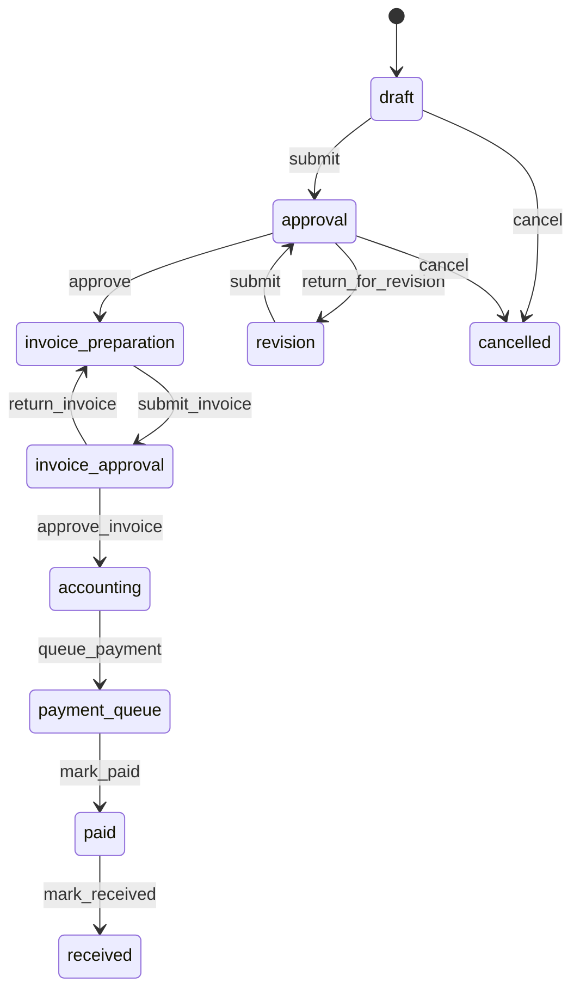

# Модуль Заявки на закупку (Purchase Requests)

**Дата:** 16.08.2026  
**Изменения:** актуализация после редизайна UI (двухпанельная раскладка, master-detail в одном окне), колонка «Инициатор», цветные статусы, артикул в позициях, многострочная форма создания; аудит кода (`lib/features/purchase_requests/`), миграций Supabase и live БД (`api.progt.ru`).

---

## Важное замечание

- **Owner таблиц:** все таблицы с префиксом `purchase_request_*` — собственность модуля.
- **Смена статуса заявки** возможна **только через RPC** (`SECURITY DEFINER`). Для роли `authenticated` на `purchase_requests` отозваны `INSERT/UPDATE/DELETE`; прямое изменение статуса через PostgREST запрещено.
- **Настройки маршрута** (`purchase_request_settings`) — одна строка на `company_id`. Сохранение — **только владелец компании** (`purchase_request_internal_is_company_owner`). Создание заявки блокируется, пока не заполнены все четыре роли и правило получателя.
- **Пользователи в настройках** — участники `company_members` с активным профилем, **не** сотрудники HR (`employees`). Список для dropdown: RPC `purchase_request_company_users`.
- **Поставщики** — контрагенты из `contractors` с типом supplier (использование, не owner).
- **Нумерация:** `ЗП-YYYY-NNNNN` через `purchase_request_number_seq`.
- **Детали заявки** открываются **в том же экране** (правая панель на desktop, полноэкранная панель на mobile). Отдельный маршрут `/purchase_requests/:id` **удалён**.
- **Edge Functions:** для модуля не зарегистрированы (проверка MCP / миграции).

---

## Описание

Модуль управляет жизненным циклом **заявок на закупку** внутри компании: от черновика с позициями до оплаты и подтверждения получения. Каждая заявка имеет **текущего ответственного** (`current_assignee_id`), историю переходов и уведомления.

### Ключевые функции

| Функция | Статус |
|---------|--------|
| Реестр с фильтрами (Мои / На мне / Все / Архив) и поиском | ✅ |
| Двухпанельный desktop-UI (sidebar + таблица / детали) | ✅ |
| Таблица: номер, объект, инициатор, дата, сумма, статус | ✅ |
| Цветные бейджи статусов (светлая / тёмная тема) | ✅ |
| Создание черновика: объект, комментарий, многострочные позиции | ✅ |
| Позиции: наименование, ед. изм., количество, артикул | ✅ |
| Редактирование позиций в `draft` / `revision` | ✅ |
| Workflow-кнопки (согласование, счета, оплата, получение) | ✅ |
| Настройки маршрута (owner-only), кнопка «Настройки» | ✅ |
| История переходов | ✅ |
| Счета (CRUD + PDF) в UI | 🔴 не реализовано |
| Файлы / документы в UI | 🔴 не реализовано |
| UI уведомлений | 🔴 не реализовано |

---

## Зависимости

### Таблицы модуля (owner)

- `purchase_requests`
- `purchase_request_items`
- `purchase_request_invoices`
- `purchase_request_files`
- `purchase_request_history`
- `purchase_request_notifications`
- `purchase_request_settings`
- `purchase_request_number_seq`

### Таблицы других модулей (usage)

| Таблица | Модуль | Использование |
|---------|--------|---------------|
| `objects` | Objects | Объект закупки (`object_id`) |
| `contractors` | Contractors | Поставщик в счетах (`supplier_id`, type = supplier) |
| `companies` | Company | `company_id`, owner gate для settings |
| `company_members` | Auth | Участники компании для dropdown настроек |
| `profiles` | Profile | ФИО инициатора в списке (`created_by_name`), `is_active` |
| `app_modules` | RBAC | Модуль `purchase_requests` в матрице прав |

### Связанные модули

- **Roles** — коды прав: `read`, `create`, `approve`, `prepare_invoice`, `approve_invoice`, `payment`, `receive`, `view_all`
- **Company** — `activeCompanyId`, `activeCompanyProvider`
- **Objects** — выбор объекта при создании
- **Contractors** — поставщики (планируется в UI счетов)

---

## Presentation

### Экраны

| Файл | Назначение |
|------|------------|
| `screens/purchase_requests_list_screen.dart` | Единый экран модуля: placeholder до настройки маршрута; desktop — двухпанельный layout; mobile — список карточек или панель деталей |
| `screens/desktop/purchase_requests_list_desktop_view.dart` | Desktop: левая панель (поиск, фильтры, «Новая заявка», «Настройки») + правая область (таблица или детали) |

### Виджеты

| Файл | Назначение |
|------|------------|
| `widgets/purchase_requests_table.dart` | Таблица реестра (desktop): колонки Номер, Объект, Инициатор, Дата, Сумма, Статус |
| `widgets/purchase_request_details_panel.dart` | Панель деталей заявки (встраивается в текущий экран): мета, позиции, история, actions bar |
| `widgets/purchase_request_card.dart` | Карточка в мобильном списке (цветной статус) |
| `widgets/purchase_request_create_dialog.dart` | Создание: объект, комментарий; позиции — строки (наименование, ед. изм., кол-во, артикул), кнопка «+» |
| `widgets/purchase_request_settings_dialog.dart` | Настройки маршрута (4 роли + режим получателя) |
| `widgets/purchase_request_actions_bar.dart` | Кнопки workflow по статусу и правам |
| `utils/purchase_request_ui_labels.dart` | Лейблы статусов, действий истории и **цвета бейджей** |
| `utils/purchase_request_module_utils.dart` | `isPurchaseRequestSettingsConfigured()` |

### Провайдеры

| Провайдер | Назначение |
|-----------|------------|
| `purchaseRequestListProvider` | Единый `StateNotifier` списка (без `family`): фильтр, поиск (debounce 300 ms), загрузка без перерисовки всего экрана |
| `purchaseRequestDetailsProvider` | Детали заявки (`family` по id) |
| `purchaseRequestItemsProvider` | Позиции |
| `purchaseRequestHistoryProvider` | История |
| `purchaseRequestSettingsProvider` | Настройки компании |
| `purchaseRequestCompanyUsersProvider` | Пользователи для dropdown |

**DI:** `supabaseClientProvider` из `lib/core/di/providers.dart`. Ошибки списка — `formatSupabaseErrorMessage` (`lib/core/utils/supabase_error_message.dart`).

### Навигация и доступ

- **Маршрут:** `/purchase_requests` (`app_router.dart`, name `purchase_requests`). Вложенный маршрут деталей **отсутствует** — выбор заявки через локальный state `_selectedRequestId`.
- **Drawer:** пункт «Заявки на закупку» (`app_drawer.dart`)
- **Матрица прав:** для `purchase_requests` отключены TMC-специфичные коды (`issue`, `move`, `repair`, …) в `permissions_matrix.dart`

### UX / раскладка

**Desktop (по образцу Cash Flow):**

```
┌─────────────────┬──────────────────────────────────────┐
│ Поиск           │  Таблица заявок  ИЛИ  Детали заявки   │
│ Мои / На мне    │                                      │
│ Все / Архив     │  Колонки: Номер | Объект | Инициатор │
│ Новая заявка    │           Дата | Сумма | Статус      │
│ Настройки       │                                      │
└─────────────────┴──────────────────────────────────────┘
```

- При смене фильтра обновляется только содержимое таблицы (индикатор внутри таблицы), каркас layout сохраняется.
- Клик по строке — детали в правой панели; кнопка «назад» возвращает к таблице.
- После создания заявки она автоматически открывается в панели деталей.

**Mobile:**

- Список карточек (`PurchaseRequestCard`) с фильтрами и поиском.
- Тап по карточке — `PurchaseRequestDetailsPanel` на весь экран с кнопкой закрытия.

**Диалог создания:**

- Ширина desktop: **980 px**.
- Каждая позиция — одна строка: наименование (растягивается), ед. изм. (80 px), кол-во (96 px), артикул (128 px).
- Кнопка «+» в заголовке секции позиций; «−» для удаления дополнительных строк.

### Design System

- `GTPrimaryButton`, `GTSecondaryButton`, `GTTextField`, `GTDropdown`
- `DesktopDialogContent`, `MobileBottomSheetContent`
- `GTSectionTitle`, `AppSnackBar`, `EdgeToEdgeScaffold`
- Форматтеры: `formatRuDate`, `formatRuDateTime`, `formatQuantity`, `formatCurrency`

---

## Domain / Data

### Сущности (domain)

| Сущность | Файл | Описание |
|----------|------|----------|
| `PurchaseRequest` | `purchase_request.dart` | Заявка (Freezed) |
| `PurchaseRequestItem` | `purchase_request_item.dart` | Позиция (`article` опционально) |
| `PurchaseRequestStatus` | `purchase_request_status.dart` | Enum статусов + `PurchaseRequestListFilter` |
| `PurchaseRequestListItem` | `purchase_request_list_item.dart` | Строка списка (`createdByName`, `initiatorLabel`) |
| `PurchaseRequestSettings` | `purchase_request_settings.dart` | Настройки маршрута |
| `PurchaseRequestHistoryEntry` | `purchase_request_history_entry.dart` | Запись истории |
| `PurchaseRequestCompanyUser` | `purchase_request_company_user.dart` | Пользователь для настроек |

### Репозиторий

- **Интерфейс:** `domain/repositories/purchase_request_repository.dart`
- **Реализация:** `data/repositories/purchase_request_repository_impl.dart`
- **Модели:** `data/models/purchase_request_models.dart` (маппинг JSON ↔ entity)

Основные операции: list, get, createDraft, submit, workflow RPCs, items CRUD (с `article`), settings get/upsert, company users, history.

---

## Дерево файлов

```
lib/features/purchase_requests/
├── data/
│   ├── models/
│   │   └── purchase_request_models.dart
│   └── repositories/
│       └── purchase_request_repository_impl.dart
├── domain/
│   ├── entities/
│   │   ├── purchase_request.dart
│   │   ├── purchase_request.freezed.dart
│   │   ├── purchase_request_item.dart
│   │   ├── purchase_request_item.freezed.dart
│   │   ├── purchase_request_list_item.dart
│   │   ├── purchase_request_company_user.dart
│   │   ├── purchase_request_settings.dart
│   │   ├── purchase_request_settings.freezed.dart
│   │   ├── purchase_request_history_entry.dart
│   │   └── purchase_request_status.dart
│   └── repositories/
│       └── purchase_request_repository.dart
└── presentation/
    ├── screens/
    │   ├── purchase_requests_list_screen.dart
    │   └── desktop/
    │       └── purchase_requests_list_desktop_view.dart
    ├── state/
    │   └── purchase_request_providers.dart
    ├── utils/
    │   ├── purchase_request_ui_labels.dart
    │   └── purchase_request_module_utils.dart
    └── widgets/
        ├── purchase_request_actions_bar.dart
        ├── purchase_request_card.dart
        ├── purchase_request_create_dialog.dart
        ├── purchase_request_details_panel.dart
        ├── purchase_request_settings_dialog.dart
        └── purchase_requests_table.dart

supabase/migrations/
├── 20260815160000_create_purchase_requests_module.sql
├── 20260815161000_purchase_requests_rpc.sql
├── 20260815170000_remove_purchase_request_required_date.sql
├── 20260815170500_purchase_request_settings_owner_gate.sql
├── 20260815172000_purchase_request_company_users_rpc.sql
├── 20260815172500_fix_purchase_request_list_created_at.sql
├── 20260815173000_purchase_request_list_created_by_name.sql
└── 20260815173500_purchase_request_item_article.sql
```

---

## База данных (Audit)

**Аудит live БД:** 16.08.2026 через MCP `project-0-projectgt-supabase`.

### Таблица `purchase_requests`

| Колонка | Тип | NULL | Описание |
|---------|-----|------|----------|
| `id` | uuid | NO | PK |
| `company_id` | uuid | NO | FK → companies |
| `number` | text | NO | Уникальный номер `ЗП-YYYY-NNNNN` |
| `object_id` | uuid | NO | FK → objects |
| `created_by` | uuid | NO | FK → auth.users |
| `current_assignee_id` | uuid | YES | Текущий ответственный |
| `status` | text | NO | Статус workflow |
| `comment` | text | YES | Комментарий инициатора |
| `total_amount` | numeric(14,2) | NO | Сумма счетов (default 0) |
| `created_at` | timestamptz | NO | |
| `updated_at` | timestamptz | NO | |
| `submitted_at` | timestamptz | YES | |
| `completed_at` | timestamptz | YES | Финальный статус |

**Индексы:** `(company_id, status)`, `(company_id, current_assignee_id)`, `(company_id, created_by, created_at DESC)`, `(company_id, object_id)`, GIN по `number`.

### Таблица `purchase_request_items`

| Колонка | Тип | NULL | Описание |
|---------|-----|------|----------|
| `id` | uuid | NO | PK |
| `company_id` | uuid | NO | FK → companies |
| `request_id` | uuid | NO | FK → purchase_requests |
| `name` | text | NO | Наименование |
| `quantity` | numeric(14,3) | NO | > 0 |
| `unit` | text | NO | Единица (текст, default `шт`) |
| `article` | text | YES | Артикул (миграция 20260815173500) |
| `comment` | text | YES | |
| `sort_order` | int | NO | Порядок |
| `created_at` | timestamptz | NO | |

### Таблица `purchase_request_invoices`

| Колонка | Тип | Описание |
|---------|-----|----------|
| `id`, `company_id`, `request_id`, `supplier_id` | | Счета поставщиков |
| `invoice_number`, `invoice_date`, `amount`, `comment` | | Реквизиты счёта |
| `created_by`, `created_at`, `updated_at` | | Аудит (UI 🔴) |

### Таблица `purchase_request_files`

| Колонка | Тип | Описание |
|---------|-----|----------|
| `id`, `company_id`, `request_id` | | Файлы заявки |
| `invoice_id` | uuid | Связь со счётом (nullable) |
| `type`, `storage_path`, `file_name`, `mime_type`, `size` | | Метаданные Storage |
| `uploaded_by`, `created_at` | | (UI 🔴) |

### Таблица `purchase_request_history`

| Колонка | Тип | Описание |
|---------|-----|----------|
| `id`, `request_id`, `from_status`, `to_status`, `action`, `actor_id`, `assignee_id`, `comment`, `metadata` (jsonb), `created_at` | | Аудит переходов; даты оплаты/получения — в `metadata` |

### Таблица `purchase_request_notifications`

| Колонка | Тип | Описание |
|---------|-----|----------|
| `id`, `company_id`, `request_id`, `user_id`, `message`, `read_at`, `created_at` | | Уведомления (UI 🔴) |

### Таблица `purchase_request_settings`

| Колонка | Тип | Описание |
|---------|-----|----------|
| `company_id` | uuid PK | |
| `first_approver_id` | uuid | Первый согласующий |
| `invoice_preparer_id` | uuid | Подготовка счетов |
| `invoice_approver_id` | uuid | Согласование счетов |
| `accountant_id` | uuid | Бухгалтер |
| `receiver_mode` | text | `fixed` \| `initiator` |
| `fixed_receiver_id` | uuid | При `receiver_mode = fixed` |
| `created_at`, `updated_at`, `updated_by` | | |

### Таблица `purchase_request_number_seq`

| Колонка | Тип | Описание |
|---------|-----|----------|
| `company_id`, `year`, `last_number` | | Счётчик номеров по году |

### RLS

| Таблица | RLS |
|---------|-----|
| `purchase_requests` | ✅ Включён |
| `purchase_request_items` | ✅ |
| `purchase_request_invoices` | ✅ |
| `purchase_request_files` | ✅ |
| `purchase_request_history` | ✅ |
| `purchase_request_notifications` | ✅ |
| `purchase_request_settings` | ✅ |
| `purchase_request_number_seq` | ❌ Отключён (internal) |

Политики: чтение по `company_id` + `check_permission`; изменение статуса заявки — только RPC.

### Storage

- Bucket: `purchase-requests` (политики на upload/read по `company_id` в путях файлов)

### RPC (публичные)

| Функция | Назначение |
|---------|------------|
| `purchase_request_list` | Список с фильтром `mine` / `on_me` / `all` / `archive`; возвращает `created_by_name` (join `profiles`) |
| `purchase_request_create_draft` | Черновик (+ gate: settings configured) |
| `purchase_request_submit` | `draft` → `approval` |
| `purchase_request_approve` | Согласование |
| `purchase_request_return_for_revision` | Возврат на доработку |
| `purchase_request_prepare_invoice` | Переход к подготовке счетов |
| `purchase_request_submit_invoice` | Отправка на согласование счетов |
| `purchase_request_approve_invoice` | Согласование счетов → бухгалтерия |
| `purchase_request_return_invoice` | Возврат счетов |
| `purchase_request_queue_payment` | Очередь оплаты |
| `purchase_request_mark_paid` | Оплачено → получатель |
| `purchase_request_mark_received` | Получено (финал) |
| `purchase_request_cancel` | Отмена |
| `purchase_request_get_settings` | Настройки компании |
| `purchase_request_upsert_settings` | Сохранение (owner only) |
| `purchase_request_company_users` | Список пользователей для dropdown |

**Возврат `purchase_request_list`:** `id`, `number`, `object_id`, `object_name`, `status`, `created_by`, `created_by_name`, `current_assignee_id`, `total_amount`, `created_at`, `items_preview`, `items_count`.

### Внутренние функции

- `purchase_request_internal_transition` — единая точка смены статуса + history
- `purchase_request_internal_notify` — записи в notifications
- `purchase_request_internal_resolve_receiver` — получатель по settings
- `purchase_request_internal_settings_configured` — проверка полноты настроек
- `purchase_request_internal_is_company_owner` — gate для settings
- `purchase_request_internal_generate_number` — нумерация

### Статистика live (16.08.2026)

| Таблица | Строк |
|---------|-------|
| `purchase_requests` | 10 |
| `purchase_request_items` | 14 |
| `purchase_request_history` | 13 |
| `purchase_request_settings` | 1 |
| `purchase_request_notifications` | 2 |
| `purchase_request_invoices` | 0 |
| `purchase_request_files` | 0 |

---

## Бизнес-логика

### Статусы

| Код | UI (рус.) | Цвет бейджа |
|-----|-----------|-------------|
| `draft` | Черновик | Серый |
| `approval` | Согласование | Синий |
| `revision` | Доработка | Оранжевый |
| `invoice_preparation` | Подготовка счетов | Бирюзовый |
| `invoice_approval` | Согласование счетов | Фиолетовый |
| `accounting` | Бухгалтерия | Индиго |
| `payment_queue` | Очередь оплаты | Янтарный |
| `paid` | Оплачено | Зелёный |
| `received` | Получено | Тёмно-зелёный |
| `cancelled` | Отменено | Красный |

Цвета заданы в `PurchaseRequestUiLabels.statusColor` (отдельные значения для light/dark).

### Workflow (основной путь)



### Ответственные (`current_assignee_id`)

| Этап | Assignee |
|------|----------|
| `draft`, `revision` | `created_by` |
| `approval` | `settings.first_approver_id` |
| `invoice_preparation` | `settings.invoice_preparer_id` |
| `invoice_approval` | `settings.invoice_approver_id` |
| `accounting`, `payment_queue` | `settings.accountant_id` |
| `paid` | Получатель: `fixed_receiver_id` или `created_by` (`receiver_mode`) |
| `received`, `cancelled` | `NULL` |

### Права на действия (RPC)

| Действие | Permission | Assignee check |
|----------|------------|----------------|
| Создание / submit | `create` | автор |
| approve / return revision | `approve` | current |
| prepare / submit invoice | `prepare_invoice` | current |
| approve / return invoice | `approve_invoice` | current |
| queue payment / mark paid | `payment` | current |
| mark received | `receive` | current |
| Список `all` / `archive` | `view_all` | — |
| Чтение своих | `read` | created_by или assignee |

### Gate: настройки перед созданием

`purchase_request_create_draft` вызывает `purchase_request_internal_settings_configured`:

- `first_approver_id`, `invoice_preparer_id`, `invoice_approver_id`, `accountant_id` — NOT NULL
- `receiver_mode = fixed` → `fixed_receiver_id` NOT NULL
- `receiver_mode = initiator` → fixed не требуется

### Позиции

- Добавление/редактирование/удаление — только в `draft` и `revision`
- Submit без позиций — ошибка на клиенте (`actions_bar`) и на сервере
- `unit` — свободный текст (например «шт.», «м»)
- `article` — опциональный артикул; отображается в панели деталей и сохраняется при создании заявки
- В диалоге добавления позиции из деталей артикул пока **не запрашивается** (техдолг)

### Получение после оплаты

`purchase_request_mark_paid` назначает `current_assignee_id` = resolved receiver и создаёт уведомление. `mark_received` записывает `received_date` в metadata истории и завершает заявку (`completed_at`).

### Нумерация

Формат: `ЗП-{год}-{5 цифр}`. Счётчик в `purchase_request_number_seq` по `(company_id, year)`.

---

## Интеграции

| Компонент | Связь |
|-----------|-------|
| **RBAC** | `app_modules` code `purchase_requests`; `check_permission` в RPC |
| **Objects** | `object_id` при создании |
| **Contractors** | `purchase_request_invoices.supplier_id` (планируется UI) |
| **Profiles** | `created_by_name` в `purchase_request_list` |
| **Supabase Storage** | bucket `purchase-requests` для файлов счетов |
| **Notifications** | Таблица + RPC notify; in-app UI отсутствует |
| **Edge Functions** | Не используются |

---

## Roadmap

### Реализовано 🟢

- Схема БД, RLS, Storage bucket
- Полный набор workflow RPC
- Двухпанельный desktop-UI (sidebar + таблица / детали)
- Master-detail в одном экране (без отдельного route)
- Таблица с инициатором и цветными статусами
- Многострочное создание заявки с артикулом
- Панель деталей, позиции, история, workflow actions
- Настройки маршрута (owner), кнопка «Настройки»
- Матрица прав, drawer, router
- Human-readable ошибки Supabase в UI
- `created_by_name` в RPC списка

### Баги / техдолг 🟡

- UI счетов не связан с `purchase_request_invoices`
- Блок «Документы» / `purchase_request_files` не в UI
- Уведомления пишутся в БД, но не отображаются
- Добавление позиции из деталей — без поля артикула
- E2E сценарий по ТЗ (20 шагов) не автоматизирован

### Планы 🔴

1. Экран/секция «Счета»: CRUD, выбор поставщика, upload PDF
2. Секция «Документы» с Storage
3. Badge / список уведомлений в модуле
4. Артикул в диалоге добавления позиции из деталей
5. Экспорт списка заявок (если потребуется `export` permission)
6. Cross-link в `docs/database_structure.md`

---

## Права модуля (RBAC)

Коды в `permissionsList` + использование в RPC:

| Code | Название в UI |
|------|---------------|
| `read` | Просмотр |
| `create` | Создание |
| `approve` | Согласование |
| `prepare_invoice` | Счета |
| `approve_invoice` | Согласование счетов |
| `payment` | Оплата |
| `receive` | Получение |
| `view_all` | Все заявки |

Для модуля **отключены** в матрице: `update`, `delete`, `export`, `import`, `issue`, `move`, `repair`, `write_off`, `inventory`, `view_cost`, `manage_catalogs`.

---

*Документ подготовлен по аудиту кода и live PostgreSQL. При изменении миграций или RPC — обновить этот файл.*
